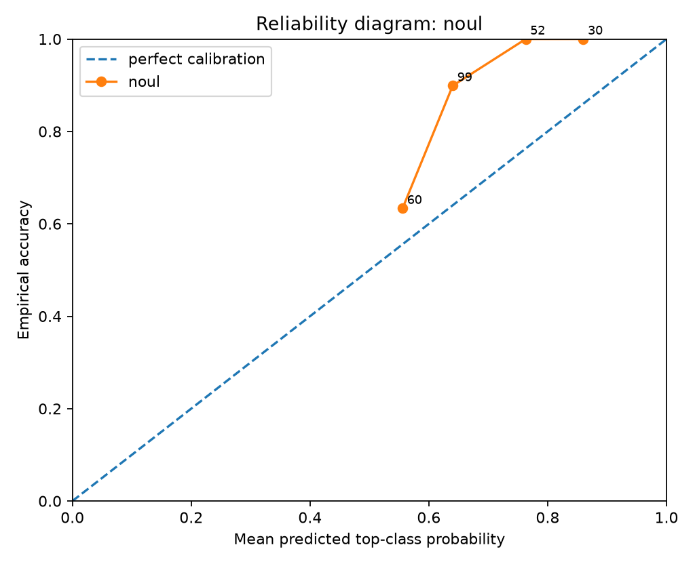
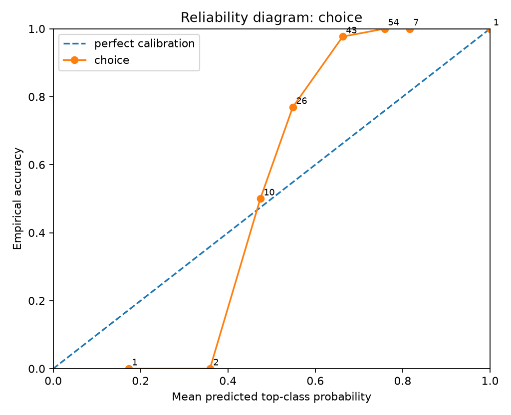
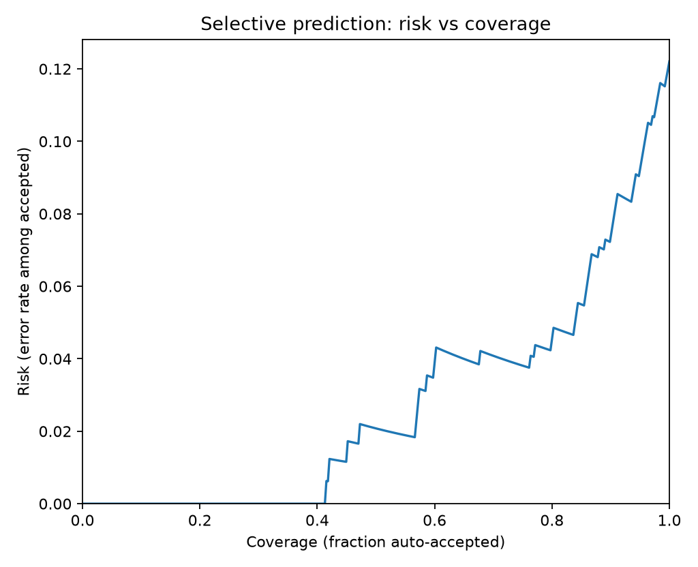
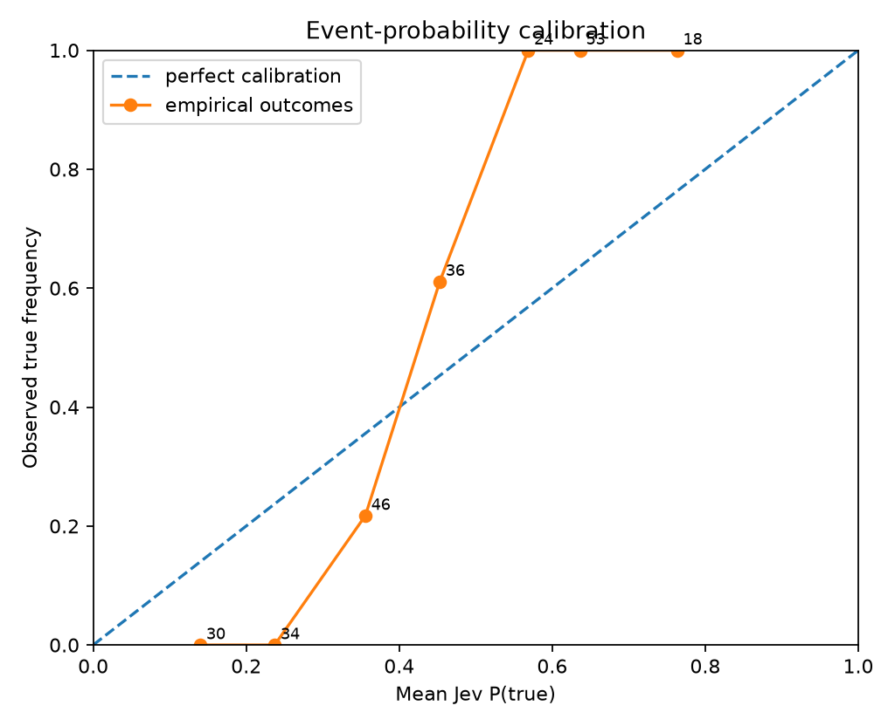
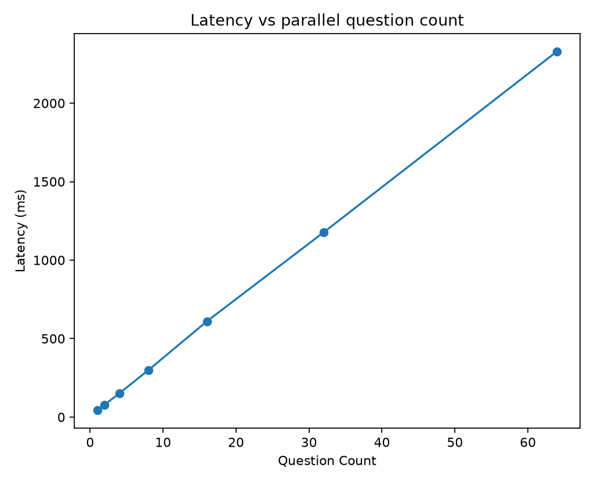
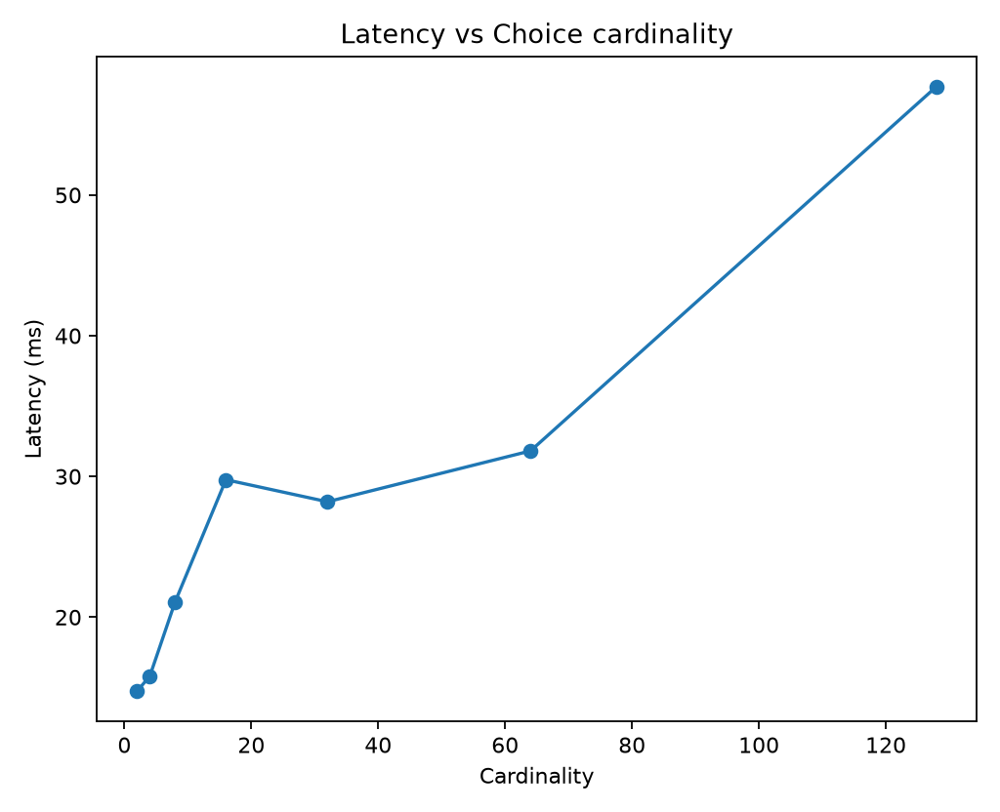
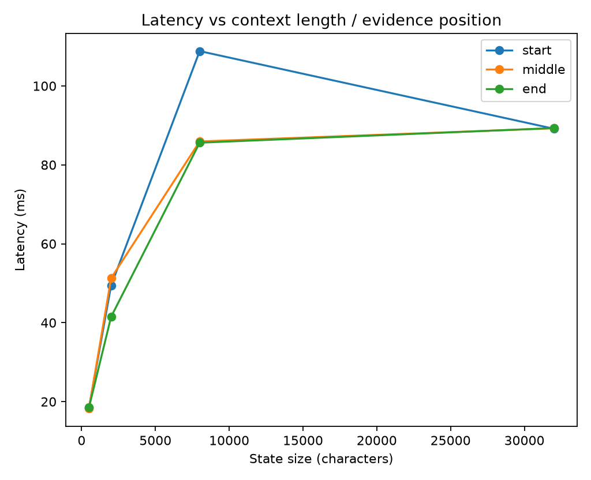

# Jev Black-Box Benchmark Report

> Private evaluation report. Verify your contractual permissions before publishing benchmark results.

## Run health

- Requests: **303** total, **303** successful, **0** failed.
- Latency: p50 **12.8 ms**, p95 **49.7 ms**, p99 **296.6 ms**.

## Calibration and correctness

- **noul**: n=241, accuracy=0.8672, brier_mean=0.1391, nll_mean=0.4513, ece_15=0.1942
- **choice**: n=144, accuracy=0.8958, brier_mean=0.2371, nll_mean=1.0632, ece_15=0.2953
- **score**: n=62, accuracy=0.6613, brier_mean=n/a, nll_mean=0.6852, mae_mean=0.4934

### By experiment

- **calibration_choice**: n=50, accuracy=1.0000, brier_mean=0.1207, nll_mean=0.3479
- **calibration_noul_factual**: n=50, accuracy=1.0000, brier_mean=0.0961, nll_mean=0.3627
- **calibration_noul_negation**: n=50, accuracy=1.0000, brier_mean=0.0580, nll_mean=0.2583
- **calibration_score**: n=50, accuracy=0.5800, nll_mean=0.8083, mae_mean=0.5661
- **candidate_order_invariance**: n=16, accuracy=1.0000, brier_mean=0.0636, nll_mean=0.2432
- **choice_cardinality_scaling**: n=7, accuracy=0.5714, brier_mean=0.5376, nll_mean=11.9519
- **context_length_position**: n=12, accuracy=0.6667, brier_mean=0.4372, nll_mean=0.8282
- **contradiction_sensitivity**: n=2, accuracy=0.5000, brier_mean=0.5931, nll_mean=0.9174
- **domain_generalization**: n=6, accuracy=0.8333, brier_mean=0.2335, nll_mean=0.5511
- **evidence_removal**: n=4, accuracy=0.7500, brier_mean=0.3306, nll_mean=0.6600
- **irrelevant_context_robustness**: n=6, accuracy=1.0000, brier_mean=0.2403, nll_mean=0.5090
- **label_key_invariance**: n=16, accuracy=1.0000, brier_mean=0.2170, nll_mean=0.5141
- **parallel_question_scaling**: n=127, accuracy=0.7559, brier_mean=0.1965, nll_mean=0.5821
- **question_independence**: n=6, accuracy=0.0000, brier_mean=1.1093, nll_mean=2.1430
- **question_paraphrase_invariance**: n=8, accuracy=1.0000, brier_mean=0.1739, nll_mean=0.4058
- **repeatability**: n=36, accuracy=1.0000, brier_mean=0.0821, nll_mean=0.2386, mae_mean=0.1906
- **state_prompt_injection**: n=1, accuracy=1.0000, brier_mean=0.1120, nll_mean=0.3325

### Selective prediction

- At ~50% coverage: error/risk **2.07%**, threshold **0.6690**, n=193.
- At ~75% coverage: error/risk **3.81%**, threshold **0.5910**, n=289.
- At ~90% coverage: error/risk **7.49%**, threshold **0.5336**, n=347.
- At ~95% coverage: error/risk **9.29%**, threshold **0.5051**, n=366.
- At ~100% coverage: error/risk **12.21%**, threshold **0.1726**, n=385.

## Metamorphic / architectural probes

- **Candidate-order invariance:** 16 trials; mean JSD=0.000789, max JSD=0.002515, max absolute probability delta=0.042800.
- **Question paraphrase invariance:** 8 trials; mean JSD=0.000094, max JSD=0.000270.
- **Question independence:** worst max probability delta=0.001100 at bundle size 5 (JSD=0.000001).
- **Repeatability/outage:** max probability std=0.00000000, max range=0.00000000 across 12 identical calls.
- **Repeatability/severity:** max probability std=0.00000000, max range=0.00000000 across 12 identical calls.
- **Repeatability/route:** max probability std=0.00000000, max range=0.00000000 across 12 identical calls.

### Evidence removal

Expected healthy behavior: decisive-class probability/confidence should generally fall, while `insufficient` mass or entropy rises as decisive evidence is removed.

- level 0: top=[('billing', 0.7577), ('insufficient', 0.1009)], confidence=0.4572, normalized_entropy=0.5428
- level 1: top=[('billing', 0.6583), ('insufficient', 0.132)], confidence=0.3178, normalized_entropy=0.6821
- level 2: top=[('billing', 0.4942), ('shipping', 0.1972)], confidence=0.1754, normalized_entropy=0.8245
- level 3: top=[('shipping', 0.4886), ('insufficient', 0.2895)], confidence=0.2071, normalized_entropy=0.7929

## Figures

## Interpretation guardrails

- Good top-1 accuracy does **not** establish calibration.
- Good in-distribution calibration does **not** establish epistemic uncertainty under distribution shift.
- Near-zero drift under reordered options/questions supports invariance claims, but does not reveal the hidden architecture uniquely.
- A flat latency curve versus question count supports parallel execution; it does not by itself prove a particular neural architecture.
- Treat this report as a black-box behavioral evaluation, not reverse-engineering of weights or proprietary training data.