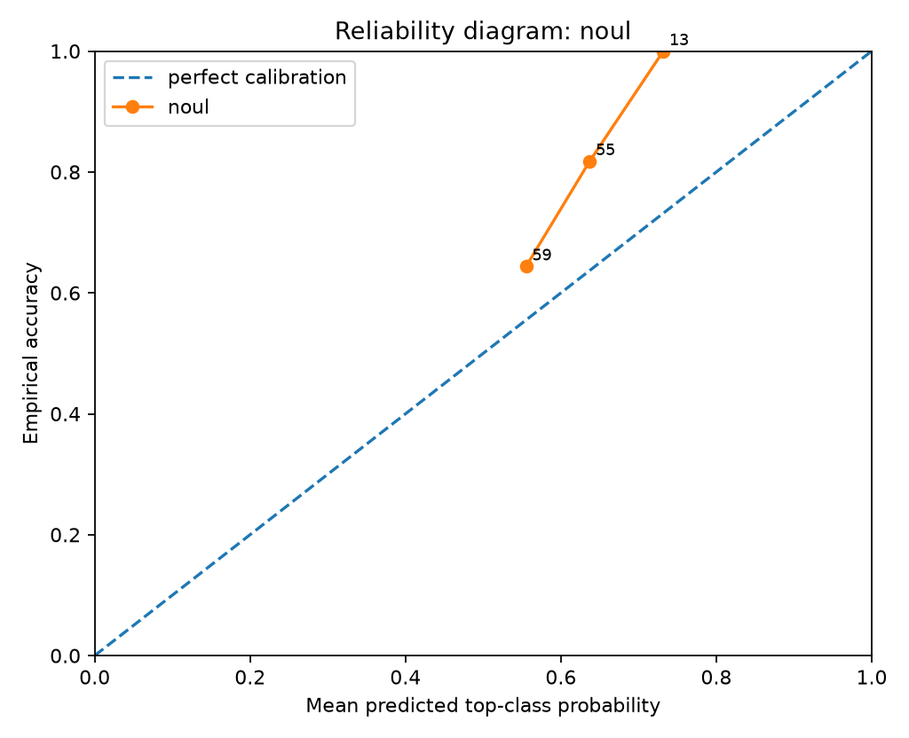
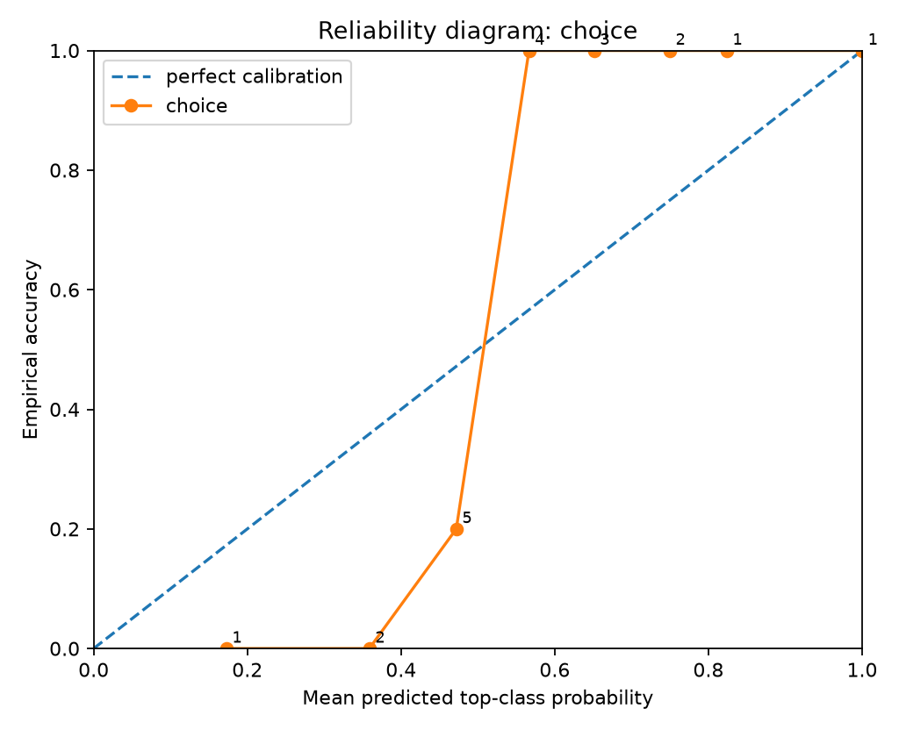
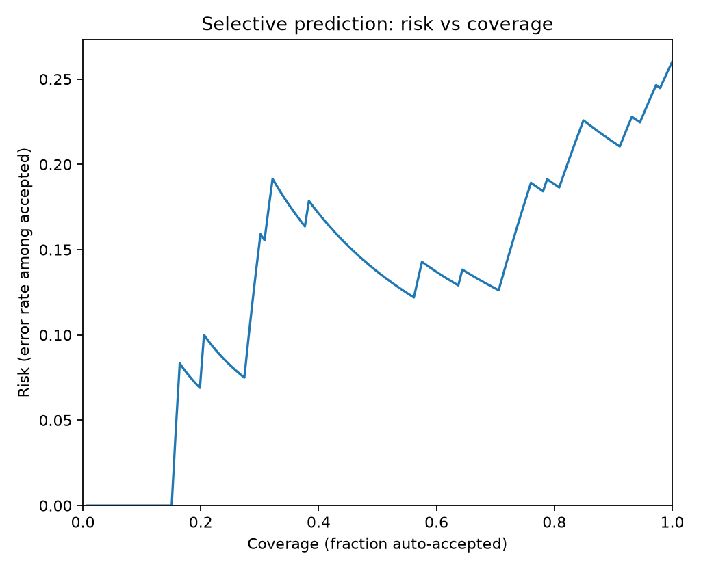
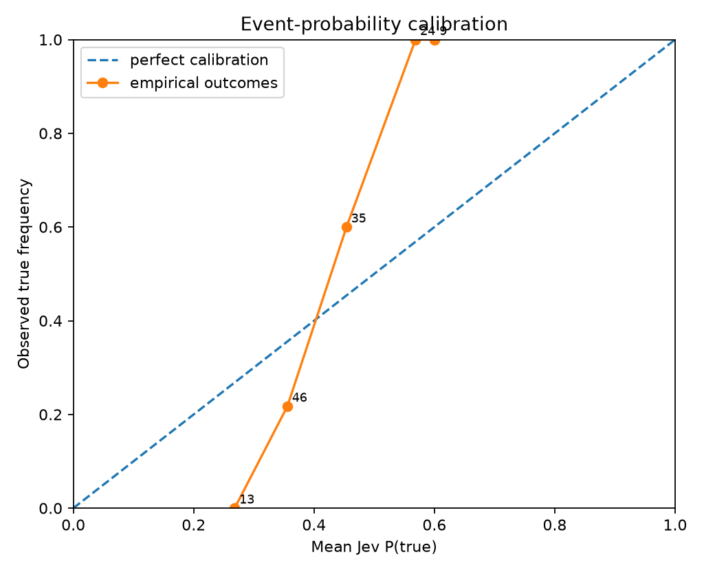
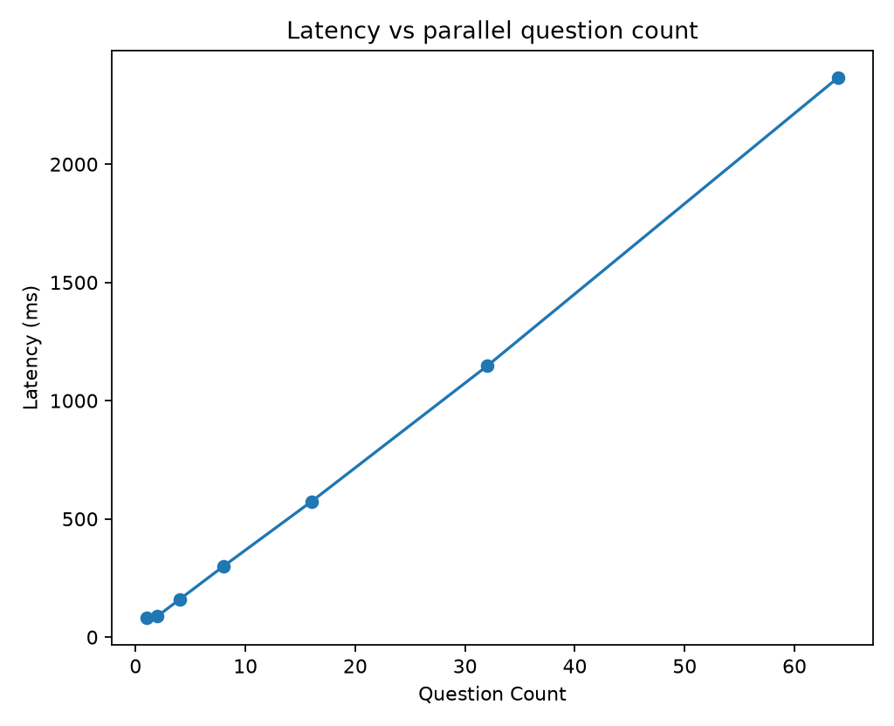
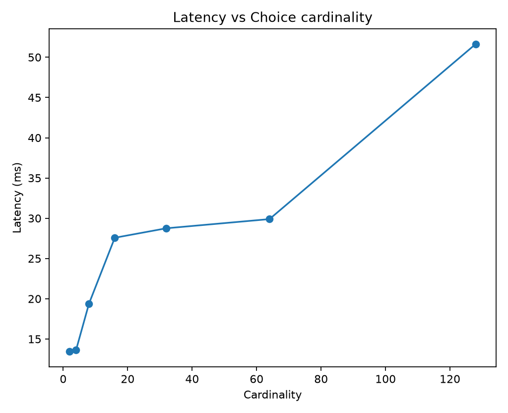
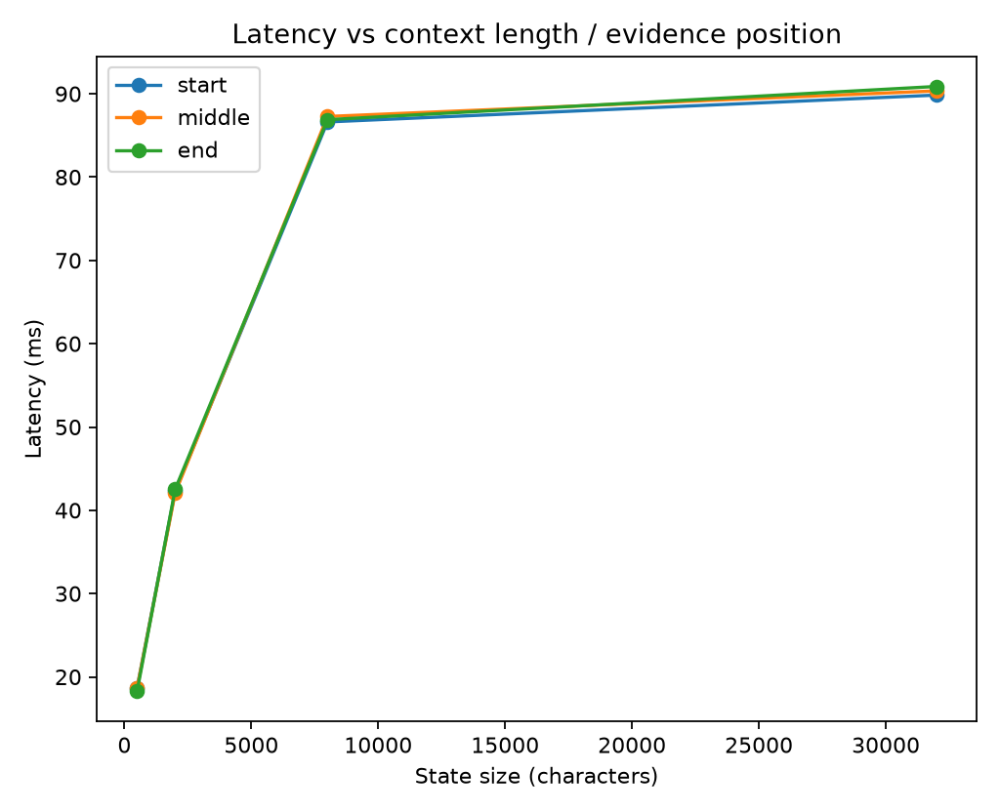

# Jev Black-Box Benchmark Report

> Private evaluation report. Verify your contractual permissions before publishing benchmark results.

## Run health

- Requests: **26** total, **26** successful, **0** failed.
- Latency: p50 **66.5 ms**, p95 **1003.1 ms**, p99 **2062.2 ms**.

## Calibration and correctness

- **noul**: n=127, accuracy=0.7559, brier_mean=0.1965, nll_mean=0.5821, ece_15=0.1471
- **choice**: n=19, accuracy=0.6316, brier_mean=0.4742, nll_mean=4.9264, ece_15=0.3569

### By experiment

- **choice_cardinality_scaling**: n=7, accuracy=0.5714, brier_mean=0.5376, nll_mean=11.9519
- **context_length_position**: n=12, accuracy=0.6667, brier_mean=0.4372, nll_mean=0.8282
- **parallel_question_scaling**: n=127, accuracy=0.7559, brier_mean=0.1965, nll_mean=0.5821

### Selective prediction

- At ~50% coverage: error/risk **13.70%**, threshold **0.6004**, n=73.
- At ~75% coverage: error/risk **18.18%**, threshold **0.5511**, n=110.
- At ~90% coverage: error/risk **21.21%**, threshold **0.5175**, n=132.
- At ~95% coverage: error/risk **23.02%**, threshold **0.4773**, n=139.
- At ~100% coverage: error/risk **26.03%**, threshold **0.1726**, n=146.

## Metamorphic / architectural probes

## Figures

## Interpretation guardrails

- Good top-1 accuracy does **not** establish calibration.
- Good in-distribution calibration does **not** establish epistemic uncertainty under distribution shift.
- Near-zero drift under reordered options/questions supports invariance claims, but does not reveal the hidden architecture uniquely.
- A flat latency curve versus question count supports parallel execution; it does not by itself prove a particular neural architecture.
- Treat this report as a black-box behavioral evaluation, not reverse-engineering of weights or proprietary training data.