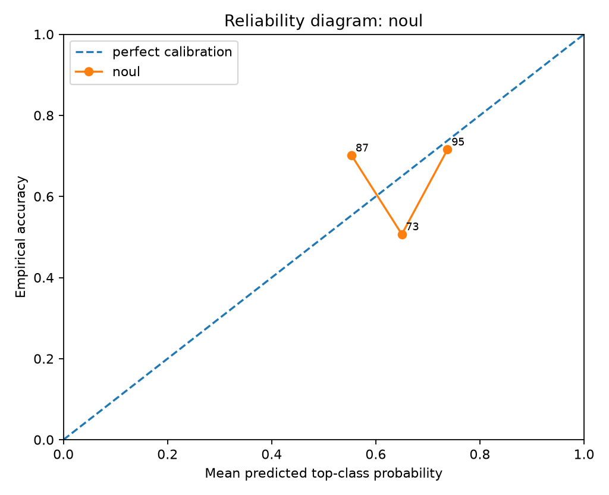
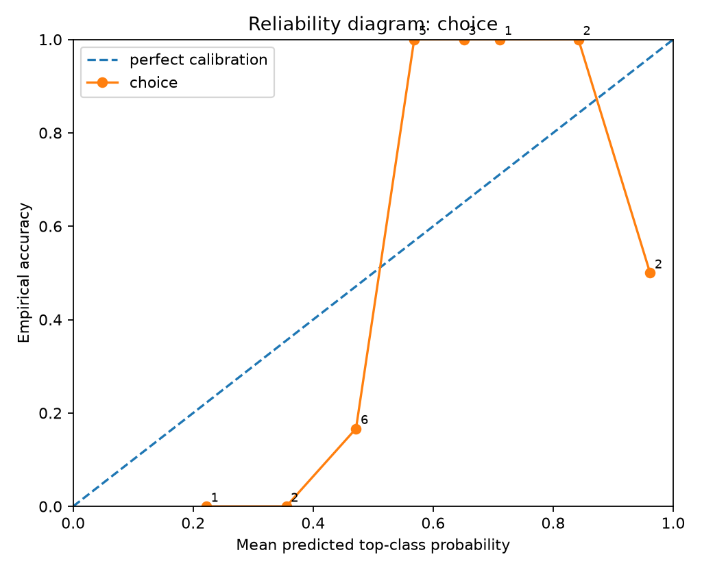
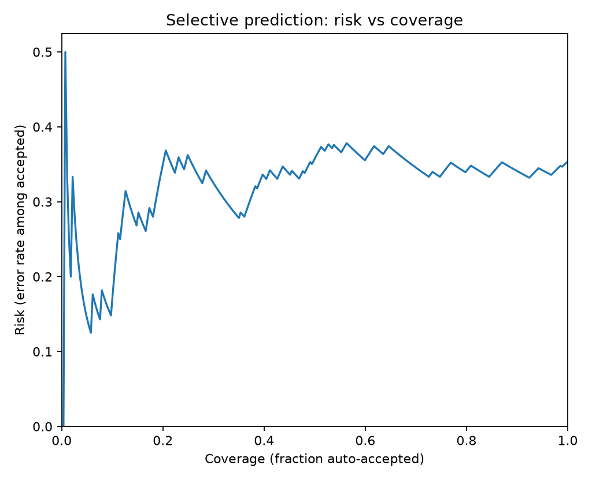
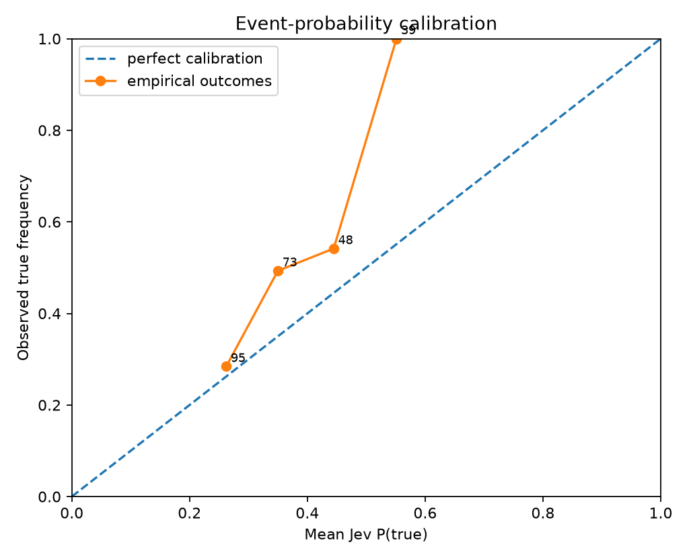
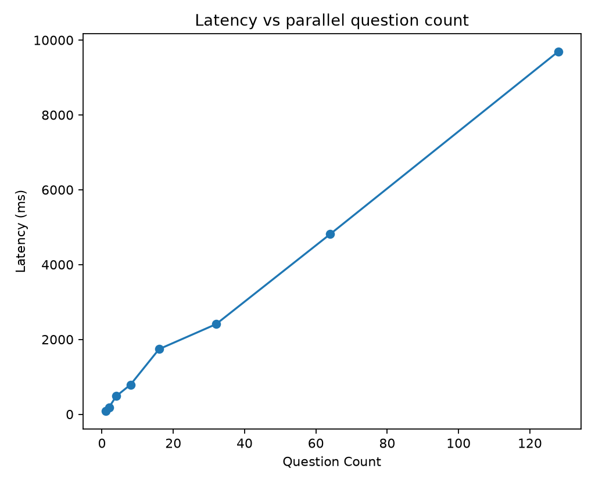
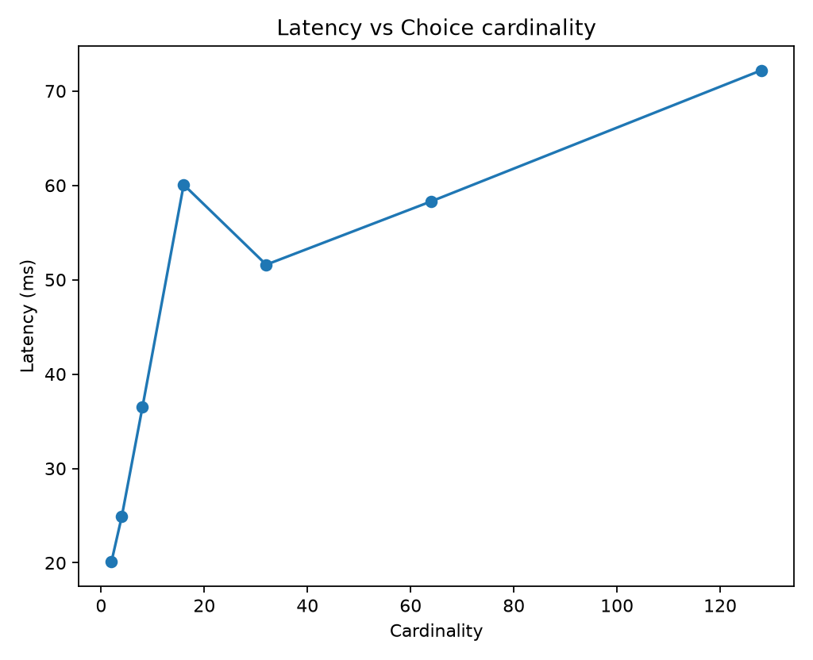
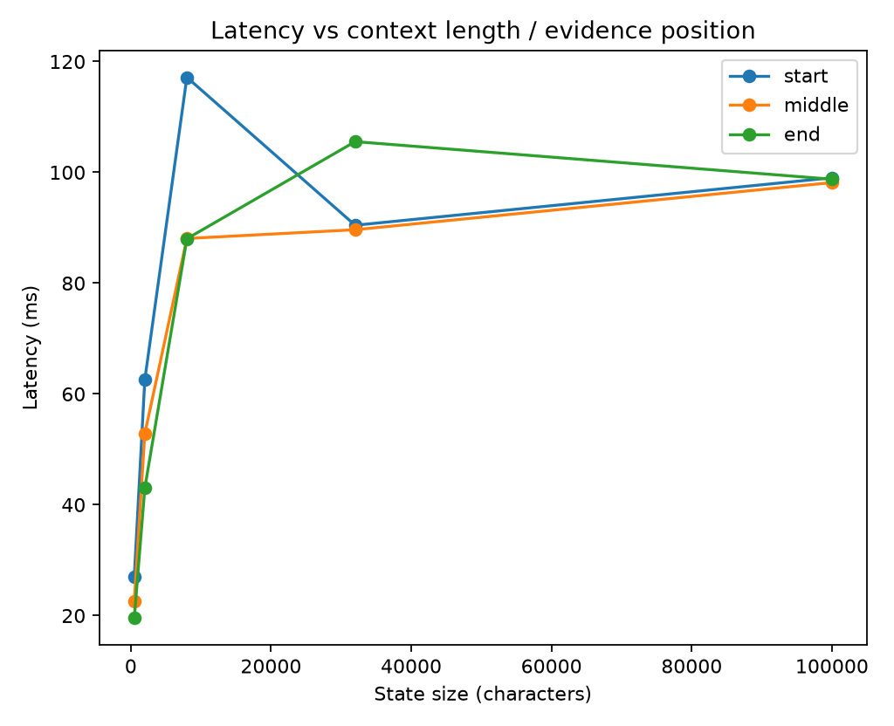

# Jev Black-Box Benchmark Report

> Private evaluation report. Verify your contractual permissions before publishing benchmark results.

## Run health

- Requests: **31** total, **30** successful, **1** failed.
- Latency: p50 **88.0 ms**, p95 **3731.0 ms**, p99 **8281.1 ms**.

## Calibration and correctness

- **noul**: n=255, accuracy=0.6510, brier_mean=0.2353, nll_mean=0.6640, ece_15=0.0995
- **choice**: n=22, accuracy=0.5909, brier_mean=0.5275, nll_mean=3.5778, ece_15=0.3895

### By experiment

- **choice_cardinality_scaling**: n=7, accuracy=0.5714, brier_mean=0.6171, nll_mean=9.3082
- **context_length_position**: n=15, accuracy=0.6000, brier_mean=0.4857, nll_mean=0.9036
- **parallel_question_scaling**: n=255, accuracy=0.6510, brier_mean=0.2353, nll_mean=0.6640

### Selective prediction

- At ~50% coverage: error/risk **35.97%**, threshold **0.6518**, n=139.
- At ~75% coverage: error/risk **33.65%**, threshold **0.5681**, n=208.
- At ~90% coverage: error/risk **34.00%**, threshold **0.5284**, n=250.
- At ~95% coverage: error/risk **34.09%**, threshold **0.5061**, n=264.
- At ~100% coverage: error/risk **35.38%**, threshold **0.2219**, n=277.

## Metamorphic / architectural probes

## Figures

## Interpretation guardrails

- Good top-1 accuracy does **not** establish calibration.
- Good in-distribution calibration does **not** establish epistemic uncertainty under distribution shift.
- Near-zero drift under reordered options/questions supports invariance claims, but does not reveal the hidden architecture uniquely.
- A flat latency curve versus question count supports parallel execution; it does not by itself prove a particular neural architecture.
- Treat this report as a black-box behavioral evaluation, not reverse-engineering of weights or proprietary training data.