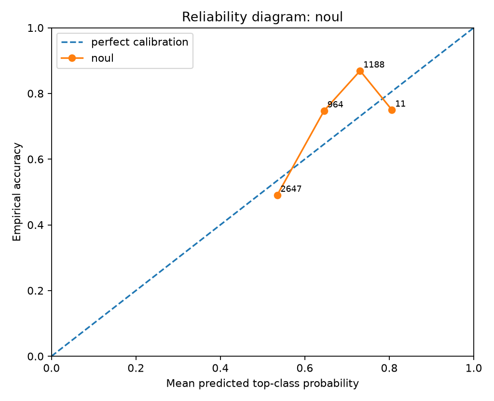
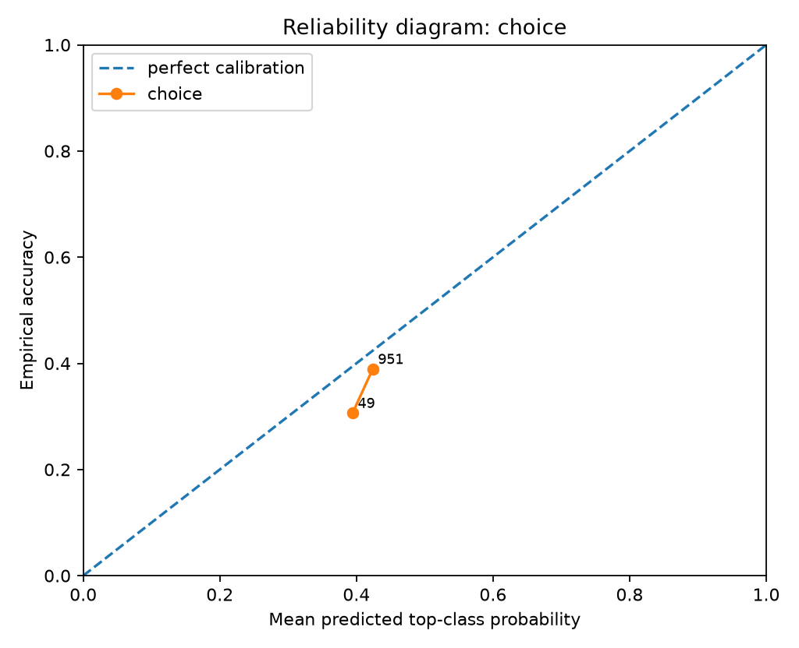
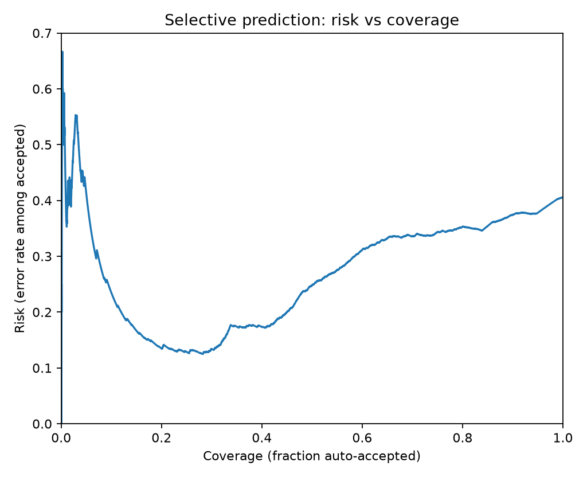
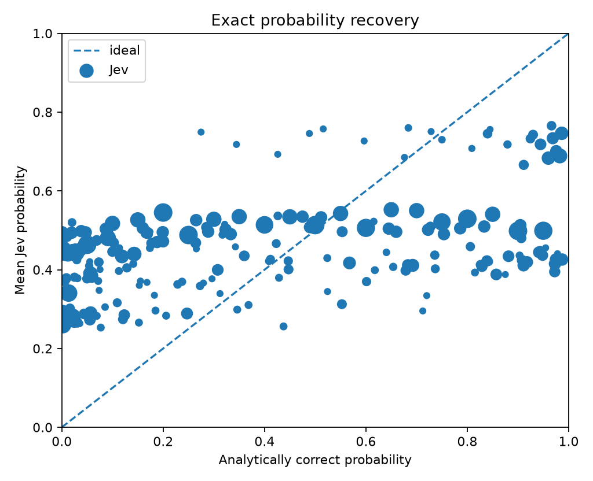
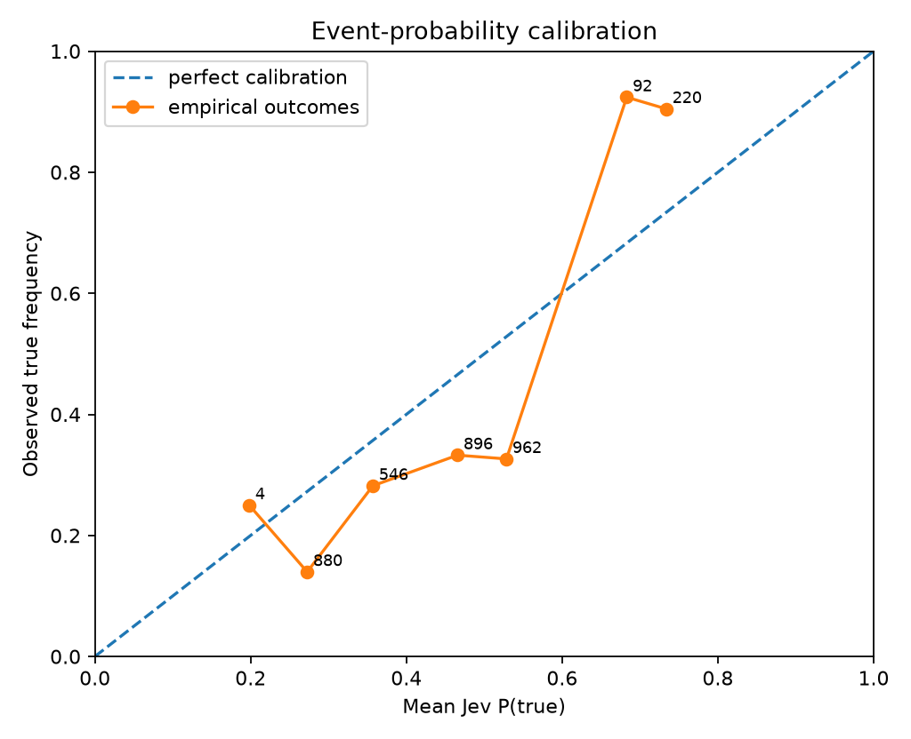
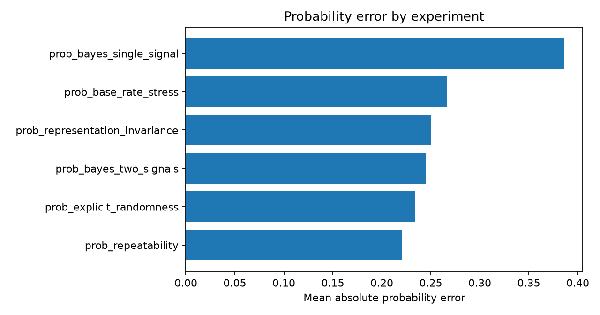

# Jev Black-Box Benchmark Report

> Private evaluation report. Verify your contractual permissions before publishing benchmark results.

## Run health

- Requests: **5810** total, **5810** successful, **0** failed.
- Latency: p50 **13.6 ms**, p95 **21.7 ms**, p99 **22.0 ms**.

## Calibration and correctness

- **noul**: n=4810, accuracy=0.6522, brier_mean=0.2061, nll_mean=0.6010, ece_15=0.0865
- **choice**: n=1000, accuracy=0.3850, brier_mean=0.6900, nll_mean=1.1456, ece_15=0.0373

### By experiment

- **prob_base_rate_stress**: n=600, accuracy=0.5967, brier_mean=0.2506, nll_mean=0.6943
- **prob_bayes_single_signal**: n=1500, accuracy=0.4833, brier_mean=0.2558, nll_mean=0.7077
- **prob_bayes_two_signals**: n=1500, accuracy=0.8433, brier_mean=0.1386, nll_mean=0.4570
- **prob_explicit_randomness**: n=760
- **prob_multiclass_bayes**: n=1000, accuracy=0.3850, brier_mean=0.6900, nll_mean=1.1456
- **prob_repeatability**: n=150
- **prob_representation_invariance**: n=300

### Selective prediction

- At ~50% coverage: error/risk **24.83%**, threshold **0.5441**, n=2300.
- At ~75% coverage: error/risk **34.35%**, threshold **0.5038**, n=3450.
- At ~90% coverage: error/risk **37.44%**, threshold **0.4210**, n=4140.
- At ~95% coverage: error/risk **37.80%**, threshold **0.4007**, n=4370.
- At ~100% coverage: error/risk **40.59%**, threshold **0.3943**, n=4600.

## Probabilistic calibration

- **Binary exact-probability recovery:** n=4810, MAE=0.2892, RMSE=0.3252, bias=0.0900, max error=0.7565, Pearson r=0.4513.
- **Sampled-world empirical calibration:** n=3600, event ECE(15)=0.1641, Brier=0.2061, NLL=0.6010.
- Returned 788 distinct binary probability values in this run.

### Probability bins

| Jev bin | n | mean Jev p | mean exact p | empirical true rate |
|---|---:|---:|---:|---:|
| 0.1-0.2 | 11 | 0.1938 | 0.3802 | 0.2500 |
| 0.2-0.3 | 968 | 0.2697 | 0.1324 | 0.1398 |
| 0.3-0.4 | 669 | 0.3559 | 0.3132 | 0.2821 |
| 0.4-0.5 | 1250 | 0.4649 | 0.3644 | 0.3326 |
| 0.5-0.6 | 1397 | 0.5344 | 0.4030 | 0.3264 |
| 0.6-0.7 | 295 | 0.6494 | 0.6687 | 0.9239 |
| 0.7-0.8 | 220 | 0.7339 | 0.8698 | 0.9045 |

- **Multiclass posterior recovery:** n=1000, mean TV=0.3427, p95 TV=0.7030, mean JSD=0.1002, mean KL(target||Jev)=0.3887, soft Brier=0.2446, sampled-label accuracy=0.3850.

## Metamorphic / architectural probes

- **Probabilistic repeatability/p20:** target=0.2000, mean=0.5541, std=0.000000, range=0.000000 across 50 identical calls.
- **Probabilistic repeatability/p50:** target=0.5000, mean=0.5466, std=0.000000, range=0.000000 across 50 identical calls.
- **Probabilistic repeatability/p80:** target=0.8000, mean=0.5401, std=0.000000, range=0.000000 across 50 identical calls.
- **Probability representation invariance:** mean within-group range=0.156168, max range=0.241800 across percent/decimal/frequency renderings.

## Figures

## Interpretation guardrails

- Good top-1 accuracy does **not** establish calibration.
- Good in-distribution calibration does **not** establish epistemic uncertainty under distribution shift.
- Near-zero drift under reordered options/questions supports invariance claims, but does not reveal the hidden architecture uniquely.
- A flat latency curve versus question count supports parallel execution; it does not by itself prove a particular neural architecture.
- Treat this report as a black-box behavioral evaluation, not reverse-engineering of weights or proprietary training data.