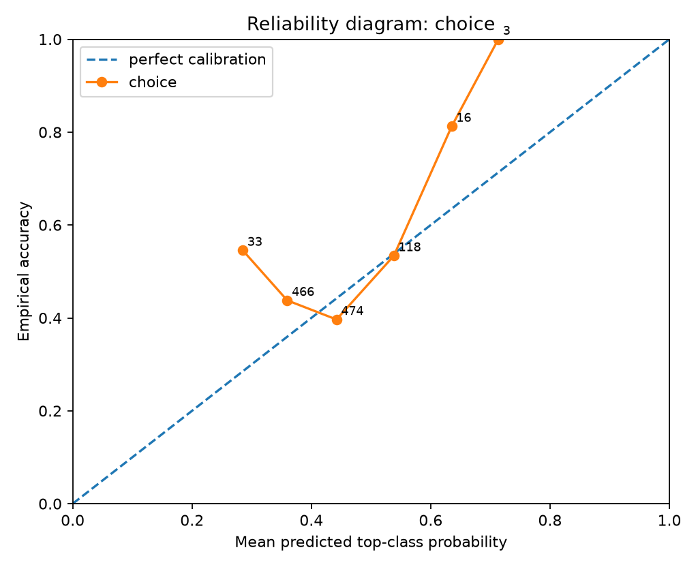
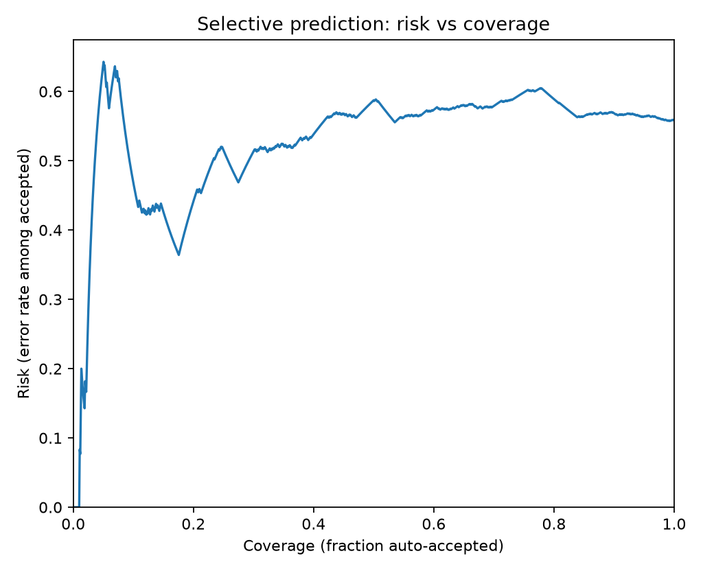
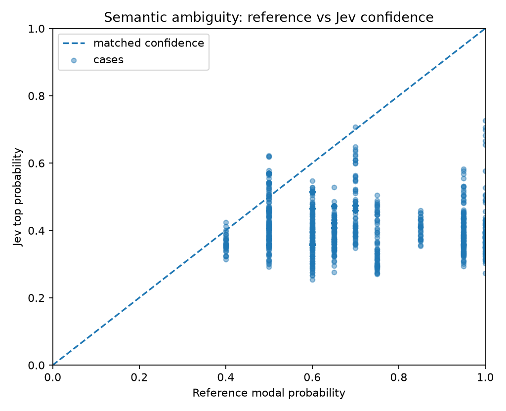
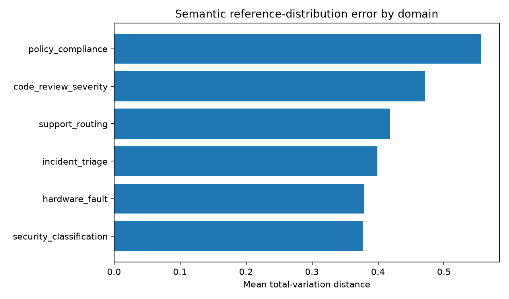

# Jev Black-Box Benchmark Report

> Private evaluation report. Verify your contractual permissions before publishing benchmark results.

## Run health

- Requests: **1110** total, **1110** successful, **0** failed.
- Latency: p50 **18.3 ms**, p95 **39.6 ms**, p99 **129.4 ms**.

## Calibration and correctness

- **choice**: n=1110, accuracy=0.4405, brier_mean=0.6690, nll_mean=1.2066, ece_15=0.1032

### By experiment

- **semantic_adjudication**: n=720, accuracy=0.4292, brier_mean=0.6609, nll_mean=1.1976
- **semantic_repeatability**: n=390, accuracy=0.4615, brier_mean=0.6838, nll_mean=1.2231

### Selective prediction

- At ~50% coverage: error/risk **58.74%**, threshold **0.4080**, n=555.
- At ~75% coverage: error/risk **59.90%**, threshold **0.3600**, n=833.
- At ~90% coverage: error/risk **56.86%**, threshold **0.3382**, n=999.
- At ~95% coverage: error/risk **56.40%**, threshold **0.3124**, n=1055.
- At ~100% coverage: error/risk **55.95%**, threshold **0.2547**, n=1110.

## Probabilistic calibration

- **Multiclass posterior recovery:** n=1110, mean TV=0.3940, p95 TV=0.7272, mean JSD=0.1311, mean KL(target||Jev)=0.4825, soft Brier=0.2473, sampled-label accuracy=0.4405.

## Semantic adjudication calibration

- Cases: **1110**; modal accuracy=0.4405; mean TV=0.3940; mean JSD=0.1311; soft Brier=0.2473.
- Mean reference top probability=0.6770; mean Jev top probability=0.4165; mean overconfidence gap=-0.2605.
- Mean normalized reference entropy=0.5408; Jev entropy=0.9227; entropy gap=0.3820.

### By semantic domain

| Domain | n | modal accuracy | mean TV | mean overconfidence gap | ref entropy | Jev entropy |
|---|---:|---:|---:|---:|---:|---:|
| code_review_severity | 210 | 0.2810 | 0.4183 | -0.2761 | 0.5845 | 0.9382 |
| hardware_fault | 150 | 0.5800 | 0.3828 | -0.3229 | 0.6142 | 0.9698 |
| incident_triage | 210 | 0.3905 | 0.3859 | -0.2353 | 0.5260 | 0.9054 |
| policy_compliance | 150 | 0.4333 | 0.4937 | -0.4331 | 0.3591 | 0.9505 |
| security_classification | 180 | 0.7667 | 0.3368 | -0.2480 | 0.5261 | 0.9160 |
| support_routing | 210 | 0.2762 | 0.3637 | -0.1130 | 0.6017 | 0.8769 |

## Metamorphic / architectural probes

## Figures

## Interpretation guardrails

- Good top-1 accuracy does **not** establish calibration.
- Good in-distribution calibration does **not** establish epistemic uncertainty under distribution shift.
- Near-zero drift under reordered options/questions supports invariance claims, but does not reveal the hidden architecture uniquely.
- A flat latency curve versus question count supports parallel execution; it does not by itself prove a particular neural architecture.
- Treat this report as a black-box behavioral evaluation, not reverse-engineering of weights or proprietary training data.