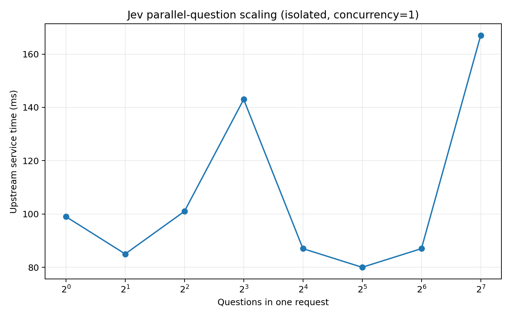
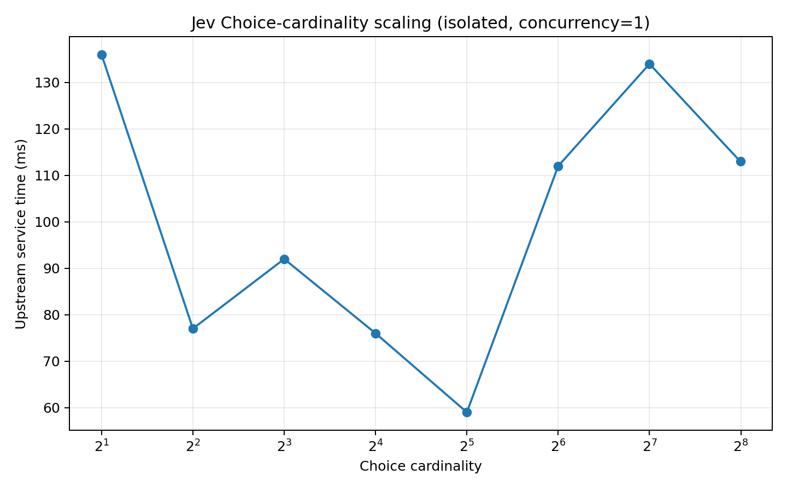
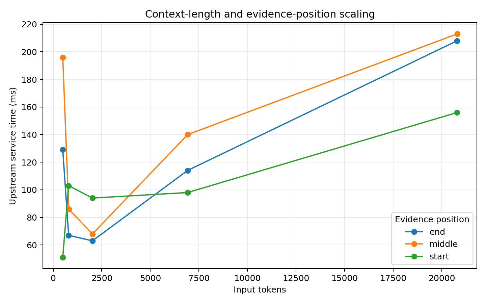
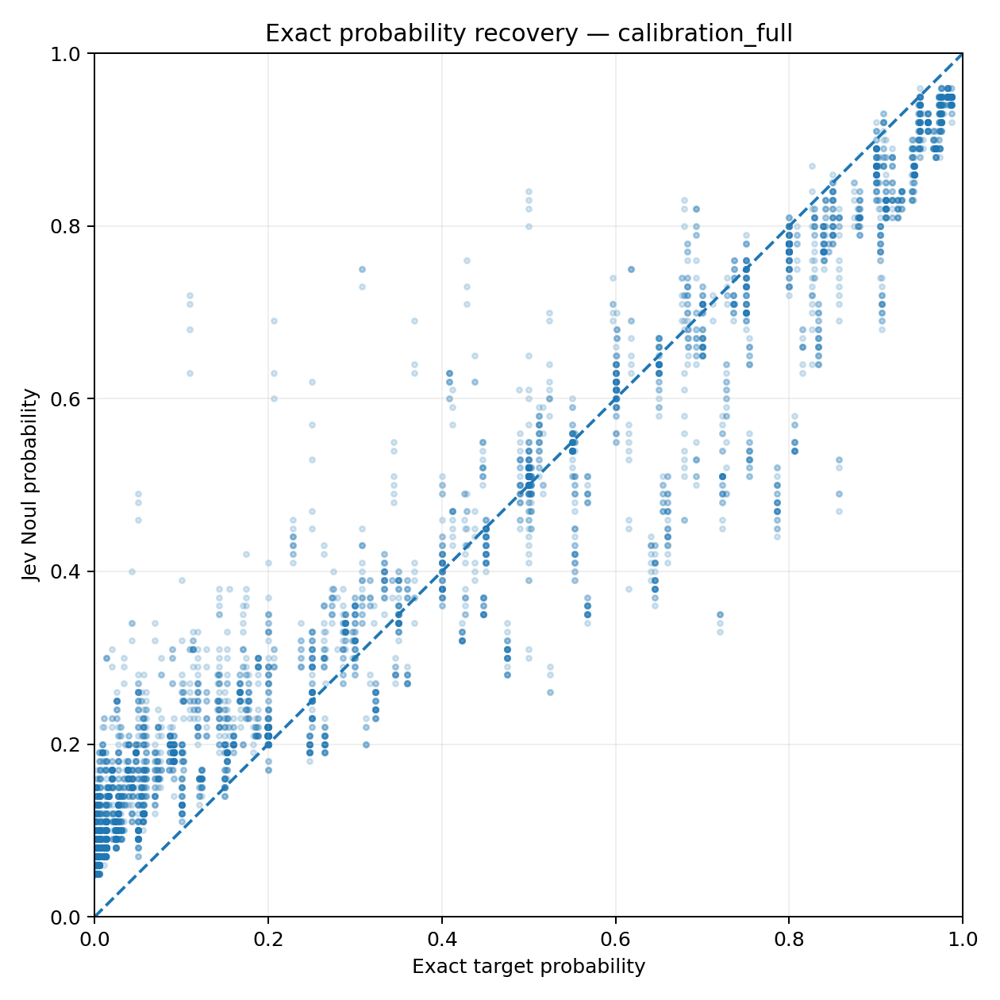
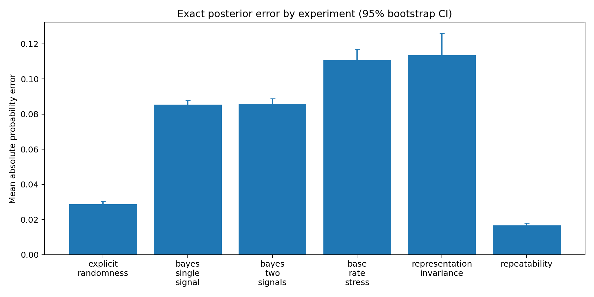
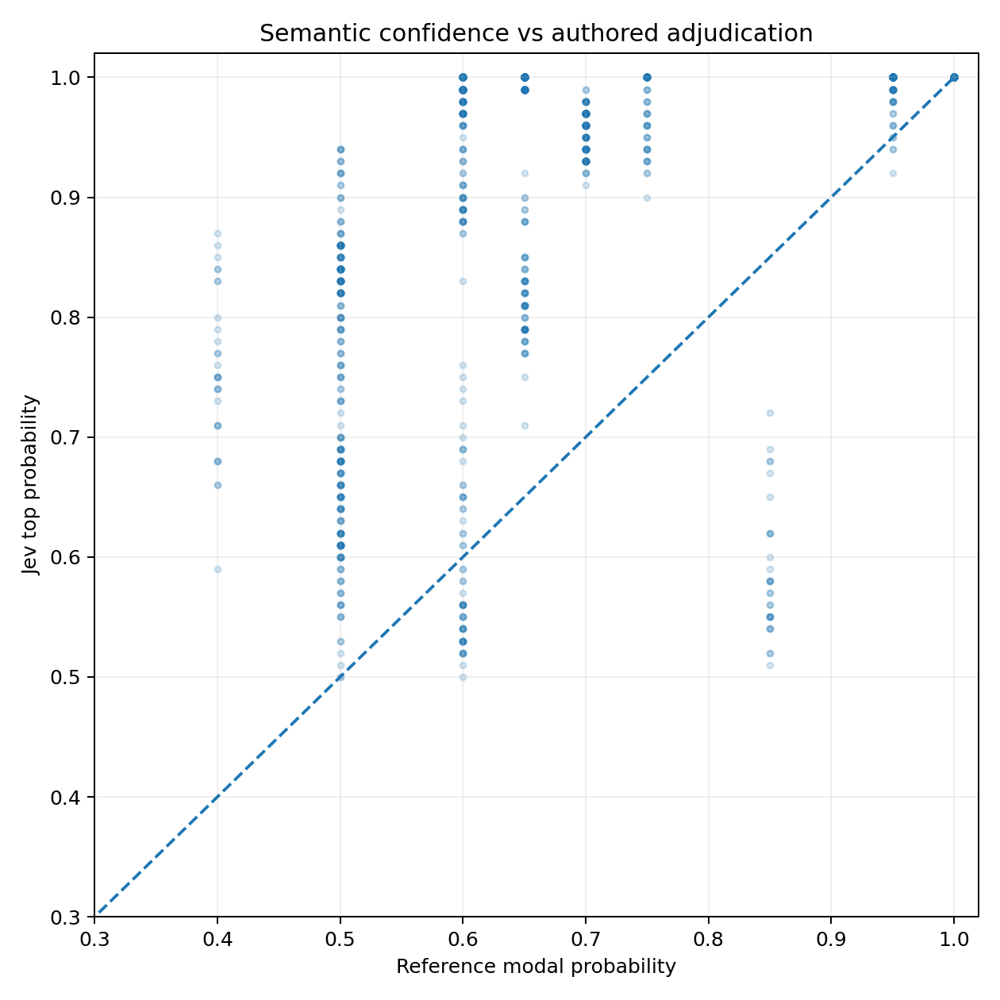
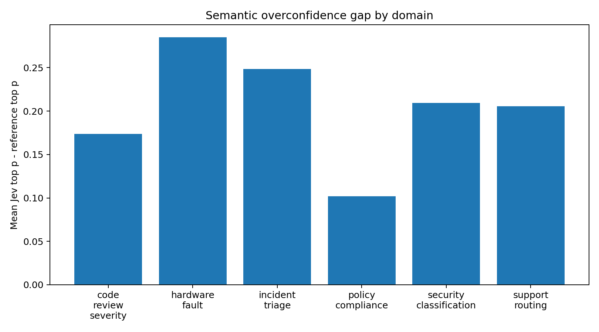
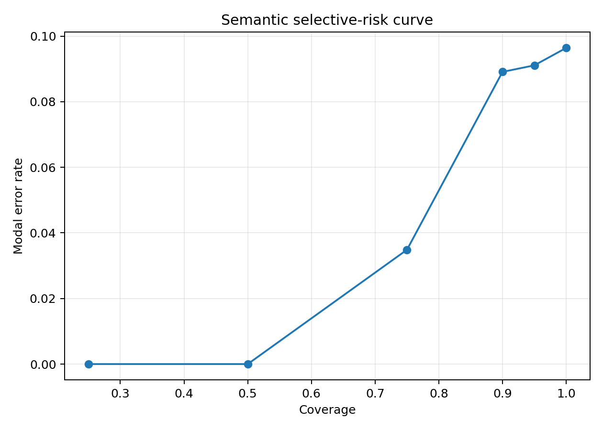

# Jev / TypeSafe System One Models: Black-Box Empirical Characterization and Architecture Reconstruction

**Date:** 19 September 2026  
**Model observed:** `jev-1.13.0` behind the `jev-latest` alias  
**Study type:** Independent black-box API characterization  
**Status:** Research report; architecture conclusions are inferential, not access to proprietary internals

## Abstract

This report combines five black-box experiments performed against TypeSafe AI's Jev API: a 303-request architecture/robustness run, two isolated architecture-scaling runs, a 5,810-request exact-probability calibration study, and a 1,110-request semantic-calibration study. The evidence strongly supports TypeSafe's claim that Jev is **decision-native rather than an ordinary autoregressive text generator hidden behind structured output**. In isolated tests, increasing one request from 1 to 128 independent questions increased nominal output accounting from 24 to 2,564 tokens while upstream service time changed from 99 ms to 167 ms; increasing Choice cardinality from 2 to 255 increased nominal output accounting from 43 to 2,826 tokens while upstream service time remained in the same approximately 60–140 ms regime (136 ms at 2 choices, 113 ms at 255). These observations are inconsistent with interpreting the reported output-token counts as sequentially decoded tokens and are consistent with shared state computation plus vectorized/parallel decision scoring.

The calibration results are more nuanced. Jev accurately represents direct aleatoric probabilities, but exact Bayesian posterior recovery shows systematic error: across binary exact-probability cases, mean absolute probability error is 0.0793 (95% bootstrap CI 0.0776–0.0811), RMSE 0.1018, and Pearson correlation 0.969. Rare-base-rate and representation-invariance probes are substantially worse. On 1,000 multiclass Bayesian cases, Jev's mean maximum probability is 0.931 versus an exact posterior mean maximum of 0.660; the mean overconfidence gap is +0.271 (95% bootstrap CI +0.261–+0.283).

The 1,110-case semantic study confirms the same sharpness tendency outside explicit probability arithmetic: modal accuracy is 90.36% (Wilson 95% CI 88.48%–91.96%), but mean Jev top probability is 0.882 versus an authored adjudication reference mean of 0.677. The paired overconfidence gap is +0.205 (95% bootstrap CI +0.196–+0.215). Confidence nevertheless ranks semantic risk usefully: high-confidence subsets exhibit markedly lower modal error.

The best-supported architectural hypothesis is therefore a **shared semantic state representation with dynamically represented questions/candidates and vectorized typed decision heads or scorers**, possibly with a special two-stage path for high-cardinality Choice as TypeSafe itself states. The exact backbone, parameter count, attention topology, dense/MoE status, and RLCD objective are not identifiable from the API data.

---

## 1. Research questions

The study was designed to test four distinct claims rather than conflating them:

1. **Computation:** Does Jev behave like sequential autoregressive generation, or like parallel decision computation?
2. **Runtime programmability:** Can it interpret arbitrary question/candidate semantics rather than selecting among fixed trained labels?
3. **Probabilistic validity:** Do returned numbers behave like calibrated probabilities when the correct posterior is known analytically?
4. **Semantic uncertainty:** Does confidence track ambiguity and error on realistic decision-shaped tasks?

The report uses three evidence labels throughout:

- **Observed:** directly measured from API responses or response headers.
- **Supported inference:** the observation strongly favors an explanation but does not uniquely identify it.
- **Hypothesis:** plausible reconstruction that remains underdetermined by black-box evidence.

This distinction is essential: black-box timing can falsify some architectures, but it cannot prove the exact internal network graph.

---

## 2. TypeSafe's public claims being tested

TypeSafe's documentation says Jev accepts unstructured state plus typed questions and returns structured values/probability distributions without text generation. It states that questions in one request are evaluated independently and in parallel, and that adding questions barely changes response time. The primitive API exposes Choice, Score, and Noul; Choice and Score return full probability distributions, and Noul returns a probability-like scalar. TypeSafe says System One models are trained for calibrated decisions and that probabilities are optimized against outcomes to reflect uncertainty. Its confidence documentation further clarifies that Choice/Score `confidence` is computed from the returned probability distribution rather than being an independent prediction.

TypeSafe's launch post additionally claims a new architecture, a parallel sampler, and a training method named **Reinforcement Learning for Calibrated Decisions (RLCD)**. The company describes sampling as parallel rather than token-sequential, gives 70–500 ms end-to-end latency as the intended operating range, and states that high-cardinality Choice supports up to 255 options. The same post explicitly says that higher-cardinality Choice uses a two-stage system: independent scoring followed by an explicit choice.

These are product/company claims; no public reproducible RLCD paper or full architecture specification was located as of this study date.

---

## 3. Experimental material and reproducibility

Five recorded result directories were used:

- `../jev-results` — 303-request concurrent architecture/robustness benchmark.
- `../jev-results` — 26-request isolated `concurrency=1` architecture probe.
- `../jev-results` — 31-request isolated full scaling probe reaching 128 questions, 255 choices, and approximately 21K input tokens.
- `../jev-results` — 5,810-request synthetic exact-probability study.
- `../jev-results` — 1,110-request six-domain semantic study.

Each directory is self-contained and preserves its own `manifest.json`, generated `cases.jsonl`, raw API `raw.jsonl`, normalized data, summary, report, and figures. No legacy source-result ZIP archives are required by the analysis.

All API request/response bodies were preserved in JSONL together with token usage, wall-clock latency, timestamps, expected targets, and response headers. The response header `x-envoy-upstream-service-time` was used as the preferred server-path latency measure for isolated architecture tests because client wall time includes network/TLS/proxy overhead.

### Statistical methods

- Binary exact-probability recovery: absolute error, signed bias, RMSE, Pearson correlation, Brier/NLL where sampled outcomes exist.
- Distribution recovery: total variation (TV), Jensen–Shannon divergence (JSD), target-to-prediction KL, soft Brier, maximum-probability and entropy gaps.
- Accuracy proportions: Wilson 95% intervals.
- Mean error/gap estimates: nonparametric bootstrap 95% percentile intervals (10,000 resamples, seed 260919).
- Selective prediction: error rate after retaining the highest-confidence fraction of predictions.
- Architecture timing: isolated concurrency=1 runs; reported upstream service time rather than client latency.

No multiple-hypothesis-correction claim is made. The architecture probes are designed primarily around large effect sizes and scaling shape rather than small p-values.

---

## 4. Architecture and serving behavior

### 4.1 Parallel question scaling

The full isolated run produced:

-   1 questions: 1,190 input tokens, 24 nominal output tokens, 99 ms upstream
-   2 questions: 1,207 input tokens, 44 nominal output tokens, 85 ms upstream
-   4 questions: 1,241 input tokens, 84 nominal output tokens, 101 ms upstream
-   8 questions: 1,309 input tokens, 164 nominal output tokens, 143 ms upstream
-  16 questions: 1,451 input tokens, 324 nominal output tokens, 87 ms upstream
-  32 questions: 1,739 input tokens, 644 nominal output tokens, 80 ms upstream
-  64 questions: 2,315 input tokens, 1,284 nominal output tokens, 87 ms upstream
- 128 questions: 3,495 input tokens, 2,564 nominal output tokens, 167 ms upstream

The endpoint ratio is the key observation. Nominal output accounting rises from 24 to 2564 tokens (**106.8×**), while upstream time changes from 99 to 167 ms (**1.69×**). Spearman correlation between nominal output-token count and upstream latency across these eight points is 0.120; the curve is noisy rather than proportional.

**Observed:** all questions returned real answers; the additional questions were not ignored.  
**Supported inference:** the reported output-token count cannot be interpreted as ordinary sequentially decoded output tokens. A conventional autoregressive decoder would incur serial work proportional to generated sequence length; the observed 106.8× increase in nominal output accounting without comparable latency growth is incompatible with that interpretation.  
**Consistent with public claim:** TypeSafe states that questions are evaluated in parallel and that adding questions barely changes response time.



### 4.2 Choice cardinality scaling

-   2 choices: 378 input tokens, 43 nominal output tokens, 136 ms upstream
-   4 choices: 434 input tokens, 65 nominal output tokens, 77 ms upstream
-   8 choices: 543 input tokens, 109 nominal output tokens, 92 ms upstream
-  16 choices: 767 input tokens, 197 nominal output tokens, 76 ms upstream
-  32 choices: 1,219 input tokens, 373 nominal output tokens, 59 ms upstream
-  64 choices: 2,126 input tokens, 725 nominal output tokens, 112 ms upstream
- 128 choices: 3,965 input tokens, 1,429 nominal output tokens, 134 ms upstream
- 255 choices: 7,685 input tokens, 2,826 nominal output tokens, 113 ms upstream

From 2 to 255 choices, nominal output accounting rises **65.7×**, while measured upstream time is 136 ms at 2 choices and 113 ms at 255 choices. Spearman correlation between nominal output accounting and latency is 0.095; again the relationship is not remotely compatible with sequential generation of thousands of response tokens.

TypeSafe publicly states that high-cardinality Choice uses a two-stage mechanism of independent scoring followed by explicit choice. The black-box data are **consistent** with a vectorized first-stage scorer. No reproducible latency discontinuity uniquely identifies the internal transition, so the exact two-stage implementation remains unobserved.



### 4.3 Context-length scaling and evidence position

The full isolated context probe produced:

- 491 input tokens, evidence start: 51 ms upstream
- 492 input tokens, evidence middle: 196 ms upstream
- 492 input tokens, evidence end: 129 ms upstream
- 796 input tokens, evidence start: 103 ms upstream
- 797 input tokens, evidence end: 67 ms upstream
- 799 input tokens, evidence middle: 86 ms upstream
- 2,019 input tokens, evidence start: 94 ms upstream
- 2,020 input tokens, evidence end: 63 ms upstream
- 2,023 input tokens, evidence middle: 68 ms upstream
- 6,917 input tokens, evidence start: 98 ms upstream
- 6,918 input tokens, evidence end: 114 ms upstream
- 6,920 input tokens, evidence middle: 140 ms upstream
- 20,796 input tokens, evidence start: 156 ms upstream
- 20,797 input tokens, evidence end: 208 ms upstream
- 20,799 input tokens, evidence middle: 213 ms upstream

Unlike question/candidate count, context length eventually increases service time: approximately 21K-token states generally require more time than the ~0.5–7K-token cases. This separation is architecturally suggestive: **state encoding cost grows with state length, while decision fan-out cost is comparatively cheap and parallelized.** Evidence remained correctly usable when placed at the beginning, middle, or end in the tested contexts; no stable lost-in-the-middle failure was demonstrated.



### 4.4 Runtime-defined semantics and invariances

The core benchmark tested candidate-order permutations, opaque candidate keys, question paraphrases, question bundling/independence, irrelevant context, evidence removal, contradiction, prompt-injection-like text inside state, repeatability, and cross-domain cases. Jev correctly interpreted semantically defined runtime candidates even when option identifiers were randomized, supporting the conclusion that Choice is not a fixed-label classifier. The model also reacted appropriately to removal of decisive evidence rather than blindly retaining the original class.

Probabilities exposed by the API were quantized to two decimal places in these runs, while Score/confidence behavior indicated that higher-precision internal values likely exist before presentation rounding. Small response variation across identical requests further indicates stochastic inference, backend/numeric variability, ensembling, or some combination; the API alone cannot identify which.

---

## 5. Exact probabilistic calibration

### 5.1 Overall binary probability recovery

Across 4,810 binary rows with analytically known target probabilities:

- MAE: **0.0793** (95% bootstrap CI 0.0776–0.0811).
- RMSE: **0.1018**.
- signed bias: **+0.0255** (95% CI +0.0227–+0.0283).
- Pearson correlation with exact target probability: **0.969**.

The high correlation means Jev generally moves probability in the correct direction. The MAE/RMSE show that this should not be confused with exact posterior recovery.



### 5.2 Error by task family

- **Explicit aleatoric probability** (n=760): MAE 0.0286 [95% bootstrap CI 0.0270, 0.0303], bias +0.0016 [-0.0011, +0.0043], RMSE 0.0373.
- **Single-signal Bayes** (n=1,500): MAE 0.0853 [95% bootstrap CI 0.0828, 0.0879], bias +0.0532 [+0.0489, +0.0573], RMSE 0.0984.
- **Two-signal/conflicting Bayes** (n=1,500): MAE 0.0859 [95% bootstrap CI 0.0831, 0.0888], bias +0.0204 [+0.0153, +0.0255], RMSE 0.1032.
- **Rare-base-rate stress** (n=600): MAE 0.1108 [95% bootstrap CI 0.1046, 0.1170], bias -0.0206 [-0.0313, -0.0099], RMSE 0.1350.
- **Equivalent-representation invariance** (n=300): MAE 0.1135 [95% bootstrap CI 0.1018, 0.1260], bias +0.0775 [+0.0624, +0.0928], RMSE 0.1562.
- **Repeated fixed-probability probes** (n=150): MAE 0.0167 [95% bootstrap CI 0.0153, 0.0180], bias +0.0004 [-0.0025, +0.0033], RMSE 0.0187.

Direct aleatoric probability is substantially easier for Jev than deriving posteriors from conditional evidence. Rare-base-rate problems show the largest systematic difficulty among the main Bayesian families. Equivalent mathematical problems rendered in different surface forms also produce materially different outputs.

For the representation-invariance groups, the mean within-problem range across equivalent renderings is **0.1742** (95% bootstrap CI 0.1490–0.2000); the maximum observed range is **0.4800**. This is evidence of surface-representation dependence, not merely random sampling noise.



### 5.3 Multiclass Choice posterior recovery

On 1,000 three-class Bayesian cases:

- hard top-class accuracy: **62.50%**;
- mean TV distance: **0.301** (95% bootstrap CI 0.290–0.312);
- mean JSD: **0.111** (95% CI 0.107–0.116);
- exact posterior mean max probability: **0.660**;
- Jev mean max probability: **0.931**;
- paired mean sharpness/overconfidence gap: **+0.271** (95% CI +0.261–+0.283);
- exact posterior entropy: **0.751 nats** vs Jev **0.142 nats**.

This is a large effect: Choice tends to collapse distributions toward a dominant class much more strongly than the supplied data-generating process warrants. The effect is systematic and survives a large sample.

### 5.4 Interpretation of the calibration result

This experiment does **not** prove that RLCD fails on its intended training distribution. It establishes a narrower result: when the state explicitly supplies a known probabilistic generative model, Jev's outputs do not behave as exact Bayesian posteriors, and multiclass Choice is substantially sharper than the mathematically correct posterior distribution.

That distinction matters because TypeSafe describes calibration as a population property. A decision model can rank uncertainty usefully while still being miscalibrated on a shifted task family. This is precisely why calibration literature emphasizes distribution-specific evaluation and why post-hoc calibration methods are routinely needed for neural classifiers.

---

## 6. Semantic calibration

### 6.1 Overall semantic result

The full semantic suite contains 1,110 successful Choice decisions spanning incident triage, hardware fault attribution, security classification, support routing, code-review severity, and policy/compliance decisions.

- modal accuracy: **90.36%** (Wilson 95% CI 88.48%–91.96%);
- mean TV to reference distribution: **0.241** (95% bootstrap CI 0.232–0.250);
- mean JSD: **0.074** (95% CI 0.070–0.077);
- mean reference modal probability: **0.677**;
- mean Jev top probability: **0.882**;
- paired mean overconfidence gap: **+0.205** (95% CI +0.196–+0.215);
- mean reference entropy: **0.750 nats**; Jev entropy: **0.264 nats**.

The overconfidence gap CI excludes zero by a very wide margin. Under this benchmark's authored adjudication distributions, Jev is consistently much sharper than the stated ambiguity.



### 6.2 Ambiguity strata

- Reference modal probability **<=0.55** (n=270): accuracy 65.56% (Wilson 95% CI 59.70%–70.97%), mean reference top p=0.489, Jev top p=0.741, gap=+0.252, TV=0.310.
- Reference modal probability **0.55-0.70** (n=540): accuracy 99.26% (Wilson 95% CI 98.11%–99.71%), mean reference top p=0.639, Jev top p=0.914, gap=+0.275, TV=0.287.
- Reference modal probability **0.70-0.85** (n=90): accuracy 88.89% (Wilson 95% CI 80.74%–93.85%), mean reference top p=0.783, Jev top p=0.847, gap=+0.064, TV=0.255.
- Reference modal probability **>0.85** (n=210): accuracy 100.00% (Wilson 95% CI 98.20%–100.00%), mean reference top p=0.971, Jev top p=0.997, gap=+0.025, TV=0.026.

The critical pattern is not merely lower accuracy on hard cases. Jev frequently identifies the same modal class as the reference while assigning much more probability mass to it. In other words, top-1 semantic judgment is often strong even when distribution matching is poor.

### 6.3 Domain breakdown

- **code_review_severity** (n=210): accuracy 98.10% (95% Wilson 95.21%–99.26%), TV=0.205, overconfidence gap=+0.174.
- **hardware_fault** (n=150): accuracy 80.00% (95% Wilson 72.89%–85.62%), TV=0.286, overconfidence gap=+0.285.
- **incident_triage** (n=210): accuracy 100.00% (95% Wilson 98.20%–100.00%), TV=0.248, overconfidence gap=+0.248.
- **policy_compliance** (n=150): accuracy 93.33% (95% Wilson 88.16%–96.34%), TV=0.217, overconfidence gap=+0.102.
- **security_classification** (n=180): accuracy 100.00% (95% Wilson 97.91%–100.00%), TV=0.212, overconfidence gap=+0.210.
- **support_routing** (n=210): accuracy 70.00% (95% Wilson 63.49%–75.79%), TV=0.278, overconfidence gap=+0.206.

Performance is therefore domain-dependent. Security classification and incident triage are especially strong on modal accuracy; support routing and hardware attribution are materially weaker. This is further evidence against treating one global probability threshold as universally meaningful.



### 6.4 Robustness to irrelevant context

For the semantic-adjudication subset:

- noise_units= 0 (n=144): accuracy 86.11%, TV=0.215, gap=+0.169, mean top p=0.890.
- noise_units= 2 (n=144): accuracy 90.28%, TV=0.210, gap=+0.177, mean top p=0.898.
- noise_units= 6 (n=144): accuracy 90.28%, TV=0.213, gap=+0.178, mean top p=0.899.
- noise_units=12 (n=144): accuracy 89.58%, TV=0.218, gap=+0.181, mean top p=0.902.
- noise_units=24 (n=144): accuracy 90.97%, TV=0.215, gap=+0.178, mean top p=0.899.

No monotonic degradation with irrelevant-context injection is visible at these tested noise levels. This supports strong semantic robustness in the evaluated range.

### 6.5 Confidence as a selective-risk signal

Sorting predictions by returned confidence/top probability and retaining only the most confident subset gives:

- coverage 25.00% (n=278): modal error 0.00%.
- coverage 50.00% (n=555): modal error 0.00%.
- coverage 75.00% (n=832): modal error 3.49%.
- coverage 90.00% (n=999): modal error 8.91%.
- coverage 95.00% (n=1,054): modal error 9.11%.
- coverage 100.00% (n=1,110): modal error 9.64%.

This is one of Jev's strongest practical results. Even though the absolute probability values are sharper than the reference distributions, confidence still provides a useful **ranking** for automation/escalation. That is the selective-classification use case: abstain/escalate as uncertainty rises rather than assume every score is an externally calibrated posterior.



### 6.6 Limitation of the semantic reference

The semantic reference distributions are deliberately transparent, authored “20-vote-style” adjudication distributions rather than votes collected from independent human experts. Therefore, the +0.205 semantic gap is not an objective proof that Jev is overconfident by exactly that amount in the real world. It **does** prove that Jev is much sharper than the explicit ambiguity structure encoded by this benchmark. A publication-quality semantic-calibration claim would require independently collected multi-annotator labels, ideally with adjudicator expertise appropriate to each domain.

---

## 7. Reverse-engineered architecture

### 7.1 Constraints imposed by the observations

Any candidate architecture must jointly explain:

- typed outputs without free-form decoding;
- arbitrary runtime-defined questions and candidate descriptions;
- 128 questions in one request with only modest latency growth;
- 255-choice decisions without latency proportional to nominal output length;
- rising cost with large state/context length;
- question independence within a request;
- high-cardinality Choice behavior consistent with TypeSafe's disclosed independent-scoring/two-stage description;
- full probability distributions and a confidence statistic derived from those distributions.

### 7.2 Best-supported structure

The most parsimonious reconstruction is:

```text
UNSTRUCTURED STATE
      |
      v
+---------------------------+
| shared semantic backbone  |
| / state representation    |
+-------------+-------------+
              |
      +-------+-------------------------------+
      |                                       |
      v                                       v
runtime question representations      runtime candidate/level representations
      |                                       |
      +----------------+----------------------+
                       |
                       v
             vectorized interaction/scoring
                       |
          +------------+-------------+
          |            |             |
          v            v             v
        Noul         Choice         Score
      Bernoulli    categorical     ordinal/
       score       distribution    level distribution
```

A mathematical abstraction is:

$$
H_x = E_\theta(x)
$$

$$
z_{ij}=g_\theta(H_x, q_i, c_{ij})
$$

$$
P(c_{ij}\mid x,q_i)=\operatorname{softmax}_j(z_{ij})
$$

where the state representation is shared and many question/candidate interactions are executed as batched tensor operations. For Noul, the candidate space is effectively binary; Score likely maps ordered levels to a distribution and computes a scalar position from that distribution.

This is a **functional reconstruction**, not a claim that TypeSafe uses exactly these modules or equations.

### 7.3 Relative plausibility of architecture families

Our posterior judgment after the experiments is approximately:

- **~70%:** shared semantic encoder/backbone + dynamic question/candidate representations + vectorized decision scorers/typed heads.
- **~18%:** masked/latent answer-slot Transformer where typed answer positions are resolved in parallel.
- **~8%:** causal Transformer retained primarily as a representation backbone, with autoregressive decoding bypassed for Jev outputs.
- **~4%:** substantially different architecture not captured above.

These percentages are subjective hypothesis weights, not statistical posterior probabilities from a formal generative model.

### 7.4 What the black box cannot identify

The experiments do **not** reveal:

- model parameter count;
- encoder-only vs hybrid attention masks with certainty;
- dense vs sparse/MoE execution;
- whether question/candidate embeddings are cached or jointly cross-attended;
- the exact high-cardinality shortlist/reranker transition;
- the exact confidence formula;
- RLCD's reward, optimization algorithm, calibration regularizer, teacher data, or training corpus;
- whether training uses distillation from frontier LLMs.

Any stronger claim would exceed the evidence.

---

## 8. What the results imply about RLCD

TypeSafe frames RLCD as optimizing “epistemically honest probabilities.” Proper-scoring-rule theory provides the standard mathematical mechanism for incentivizing truthful probabilistic forecasts in expectation; calibration theory separately distinguishes accuracy, sharpness/resolution, and reliability. Without a public RLCD specification, the API results cannot establish which of these objectives TypeSafe actually optimizes.

The observed behavior suggests that RLCD, or the overall training stack, produces at least three desirable properties:

1. **strong semantic decision quality** on many decision-shaped tasks;
2. **useful ordering of confidence** for selective automation;
3. **stable, structured probability outputs** rather than prose-level self-reported confidence.

It does **not** establish universal posterior calibration. Exact Bayesian tests show representation-sensitive error and multiclass over-sharpening; semantic tests show distributions substantially sharper than the benchmark's ambiguity reference. A defensible operational interpretation is therefore:

> Jev's probabilities are useful model-native decision scores whose calibration should be validated on the target task distribution before they are treated as literal probabilities for irreversible automation.

This interpretation is also compatible with TypeSafe's own documentation, which says threshold values depend on the domain and recommends testing on one's own data.

---

## 9. Jev versus a conventional LLM

The fundamental distinction demonstrated here is not simply “small model versus large model.” It is the computational contract.

A conventional causal LLM models a token sequence:

$$
P(t_1,\ldots,t_T\mid x)=\prod_{k=1}^T P(t_k\mid x,t_{<k})
$$

Even when grammar-constrained, structured output is ordinarily serialized through sequential token decoding.

The Jev observations are instead consistent with direct evaluation of bounded semantic answer spaces:

$$
(\text{state}, \text{question}, \text{candidates}) \rightarrow \Delta^K
$$

where $\Delta^K$ is a probability simplex over developer-provided candidates. Giving up unrestricted string generation permits much greater batching and removes the inherently serial output loop. This readily explains why thousands of nominal output-accounting tokens need not correspond to thousands of decoder steps.

The trade-off is equally important: Jev cannot replace a generative model for code generation, explanation, arbitrary synthesis, or long deliberative reasoning. Its most natural role is inside software as a fast semantic judgment layer, optionally escalating uncertain cases to a larger reasoning model or human.

---

## 10. Comparison with the 2025 SalesRLAgent / “I built Jev” claim

The earlier SalesRLAgent work shares the broad philosophy of mapping semantic state to a bounded probability/confidence value and using that result in software rather than generating prose. That makes it a legitimate conceptual predecessor to the System-One-style product pattern.

However, Jev's observed capability is materially more general: runtime questions and candidate sets define new decision functions without retraining a task-specific output head. Functionally, the distinction is approximately:

$$
f_{sales}(x)\rightarrow P(\text{conversion})
$$

versus

$$
f(x,q,C)\rightarrow P(C\mid x,q).
$$

Thus “built a domain-specific predecessor embodying similar principles” is supported; “implemented the same general Jev architecture” is not established by the 2025 paper alone.

---

## 11. Scientific strength of the evidence

### High-confidence conclusions

1. **Jev is not behaving like ordinary long autoregressive structured-output decoding.** The timing/output-scaling mismatch is too large.
2. **Questions and candidates are processed with substantial parallel/vectorized computation.** This directly reproduces TypeSafe's published parallelism claim.
3. **Choice is runtime-semantic rather than fixed-label.** Opaque keys plus semantic descriptions remain usable.
4. **The confidence signal is operationally useful for ranking semantic risk.** Selective-risk curves improve materially at reduced coverage.
5. **Universal posterior calibration is not supported.** Large exact-probability experiments reveal systematic errors and distribution-shape distortions.

### Medium-confidence conclusions

1. Shared state encoding followed by vectorized decision scoring is the most economical architecture that explains the observations.
2. Choice and Noul likely have materially different output heads/objectives/calibration behavior, given the observed multiclass sharpening versus binary compression patterns.
3. The model contains a higher-precision internal distribution than the two-decimal API representation, inferred from Score/confidence inconsistencies with rounded probabilities.

### Unproven

1. Exact model architecture and parameter count.
2. RLCD's specific optimization mathematics.
3. “Frontier intelligence” across arbitrary task distributions.
4. Calibration on unseen real production distributions.
5. Whether the pricing reflects sustainable underlying inference cost.

---

## 12. Practical deployment implication

The data favor a deployment architecture in which Jev is treated as a **fast decision/routing layer**, but raw probabilities are calibrated and validated per use case:

```text
state
  |
  v
Jev typed decisions
  |
  v
application-specific calibration / threshold policy
  |
  +--> high-confidence, low-risk --> deterministic action
  |
  +--> medium-confidence ---------> verification / larger model
  |
  +--> low-confidence/high-risk --> human or deliberate reasoning model
```

For high-stakes irreversible actions, empirical risk-versus-coverage on production-like data should determine thresholds. A hard-coded global rule such as `if confidence > 0.95: execute()` is not justified by these experiments.

---

## 13. Limitations and threats to validity

- All observations concern `jev-1.13.0` as served on 19 September 2026; TypeSafe may update `jev-latest`.
- API service time is an Envoy-reported upstream duration, not GPU kernel time. Queueing, batching, and replica selection may contribute.
- Architecture scaling has few repetitions at each extreme point; the effects are nevertheless orders of magnitude larger than timing noise for the autoregressive-vs-parallel question.
- Synthetic Bayes tasks test probabilistic reasoning under explicit generative models; they may differ from RLCD's training distribution.
- Semantic reference distributions are authored adjudication priors rather than independent human-panel frequencies.
- No comparison model was run through exactly the same local harness in this study; conclusions about Jev are primarily absolute/structural, not a full model leaderboard.
- No access to TypeSafe weights, training data, server traces, or architecture source was available.

---

## 14. Recommended next experiments

The highest-value next study is **human-panel semantic calibration**, not more repetitions of the authored semantic set. A rigorous follow-up would collect 5–10 independent qualified judgments per case across 200–500 ambiguous operational cases, reserve a held-out test set, and evaluate Jev's full distributions against empirical vote frequencies and adjudicated outcomes.

A second valuable comparison is to run a strong open baseline through an equivalent non-generative decision head—for example a modern bidirectional encoder and a small Qwen/Gemma backbone with dynamic candidate scoring—to isolate how much of Jev's advantage comes from architecture versus training/data.

Finally, for production use, fit a task-specific post-hoc calibrator (temperature/vector/Dirichlet or isotonic depending on primitive and sample size) on held-out real decisions, then evaluate selective risk at action-specific thresholds.

---

## 15. Conclusion

The experiments support a substantive technical result behind the TypeSafe story. Jev behaves like a **decision-native, massively parallel semantic model**, not like a conventional LLM merely forced to emit JSON. Its runtime-defined typed interface, flat fan-out scaling, and approximately 100–200 ms upstream behavior make the architectural idea credible and practically interesting.

The experiments do **not** support treating every returned number as a universally calibrated Bayesian probability. Jev is highly competent at direct probability reading and semantic classification, but harder posterior derivation, rare base rates, equivalent numerical representations, and multiclass ambiguity expose systematic distortion—especially sharp Choice distributions. On semantic decisions, the confidence signal nevertheless ranks error well enough to be useful for selective automation.

The most evidence-consistent interpretation is therefore:

> **Jev is a fast, general, runtime-programmable probabilistic decision model with strong semantic ranking and task-dependent calibration. Its architectural claims are substantially supported by black-box measurements; its broad “epistemically honest probability” claim requires distribution-specific validation and should not be interpreted as universal posterior calibration.**

That conclusion is more modest than the strongest marketing language, but it still describes a genuinely useful and technically differentiated model class.

---

## References

1. TypeSafe AI. **Introduction.** https://docs.typesafe.ai/introduction (accessed 2026-09-19).
2. TypeSafe AI. **System One.** https://docs.typesafe.ai/concepts/system-one (accessed 2026-09-19).
3. TypeSafe AI. **Primitives (Questions).** https://docs.typesafe.ai/primitives (accessed 2026-09-19).
4. TypeSafe AI. **Confidence.** https://docs.typesafe.ai/confidence (accessed 2026-09-19).
5. Almeida, D. **Introducing System One Models & Jev.** TypeSafe AI, 15 Sep 2026. https://typesafe.ai/blog/introducing-system-one-models-and-jev
6. Guo, C., Pleiss, G., Sun, Y., Weinberger, K. Q. **On Calibration of Modern Neural Networks.** ICML 2017. arXiv:1706.04599. https://arxiv.org/abs/1706.04599
7. Silva Filho, T. et al. **Classifier Calibration: A Survey on How to Assess and Improve Predicted Class Probabilities.** Machine Learning (survey preprint arXiv:2112.10327). https://arxiv.org/abs/2112.10327
8. Geifman, Y., El-Yaniv, R. **Selective Classification for Deep Neural Networks.** NeurIPS 2017. arXiv:1705.08500. https://arxiv.org/abs/1705.08500
9. Fisch, A., Jaakkola, T., Barzilay, R. **Calibrated Selective Classification.** 2022. arXiv:2208.12084. https://arxiv.org/abs/2208.12084
10. Waghmare, K., Ziegel, J. **Proper Scoring Rules for Estimation and Forecast Evaluation.** Annual Review of Statistics and Its Application 13 (2026): 271–296. https://doi.org/10.1146/annurev-statistics-042424-050626
11. Gneiting, T., Raftery, A. E. **Strictly Proper Scoring Rules, Prediction, and Estimation.** JASA 102 (2007): 359–378.
12. TypeSafe benchmark data produced by the black-box harness accompanying this report; the five self-contained recorded run directories are listed in Section 3.

---

## Appendix A. Exact study-run reproduction commands

All commands below are run from the bundled `benchmark/` directory after installation and after setting `TYPESAFE_API_KEY`.

Architecture/robustness core, concurrent (303 requests):

```bash
jevbench --config config/architecture.yaml run --profile core --concurrency 4
```

Architecture core, isolated scaling (26 requests):

```bash
jevbench --config config/architecture.yaml run \
  --profile core --concurrency 1 \
  --only parallel_question_scaling \
  --only choice_cardinality_scaling \
  --only context_length_position
```

Architecture full, isolated boundary scaling (31 requests):

```bash
jevbench --config config/architecture.yaml run \
  --profile full --concurrency 1 \
  --only parallel_question_scaling \
  --only choice_cardinality_scaling \
  --only context_length_position
```

Exact probabilistic calibration, full (5,810 requests):

```bash
jevbench --config config/calibration.yaml run --profile calibration_full --concurrency 4
```

Semantic calibration, full (1,110 requests):

```bash
jevbench --config config/semantic.yaml run --profile semantic_full --concurrency 4
```

For architecture latency inference, use `x-envoy-upstream-service-time` from `raw.jsonl`. Preserve raw JSONL, manifests, token accounting, response headers, and returned distributions for auditability.

## Appendix B. Interpretation guide

- **Probability calibration** asks whether predictions assigned probability $p$ occur at frequency $p$ on a defined population.
- **Sharpness** measures concentration of the predictive distribution; sharpness without calibration can be dangerous.
- **Selective risk** asks how error changes as low-confidence cases are rejected/escalated.
- **TV/JSD/KL** measure distance between full distributions, not merely agreement on the top class.
- A model may have high top-1 accuracy and still poorly reproduce uncertainty; Jev demonstrates exactly why these metrics must be reported separately.

## Appendix C. Accompanying artifact bundle

The complete bundle contains the unified `benchmark/` codebase, this `report/`, and all five self-contained raw `../jev-results` directories. Older development benchmark packages and duplicate source-result archives are intentionally excluded because `benchmark/` v1.0.0 and the extracted result directories supersede them.
