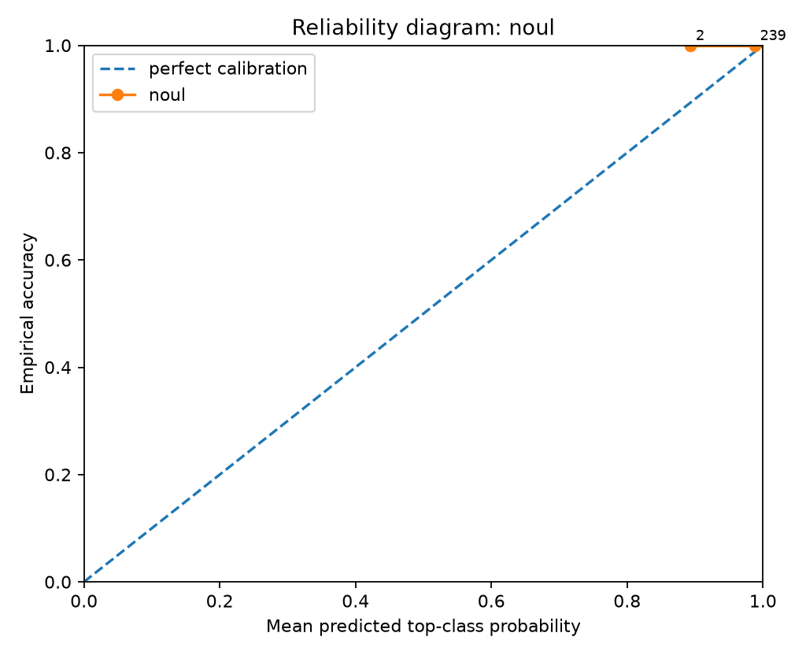
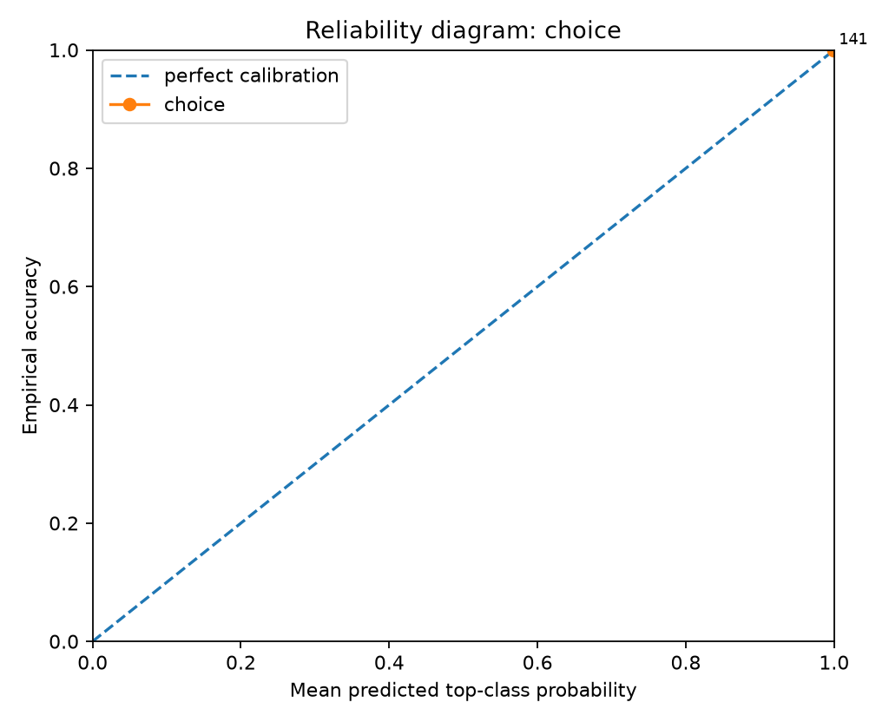
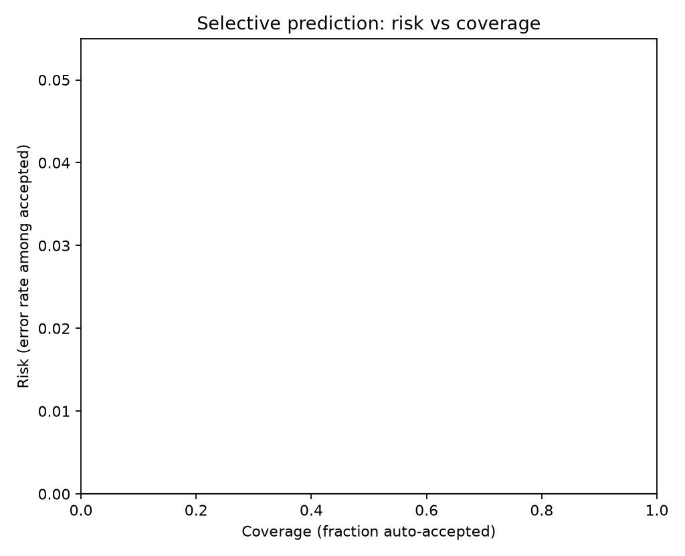
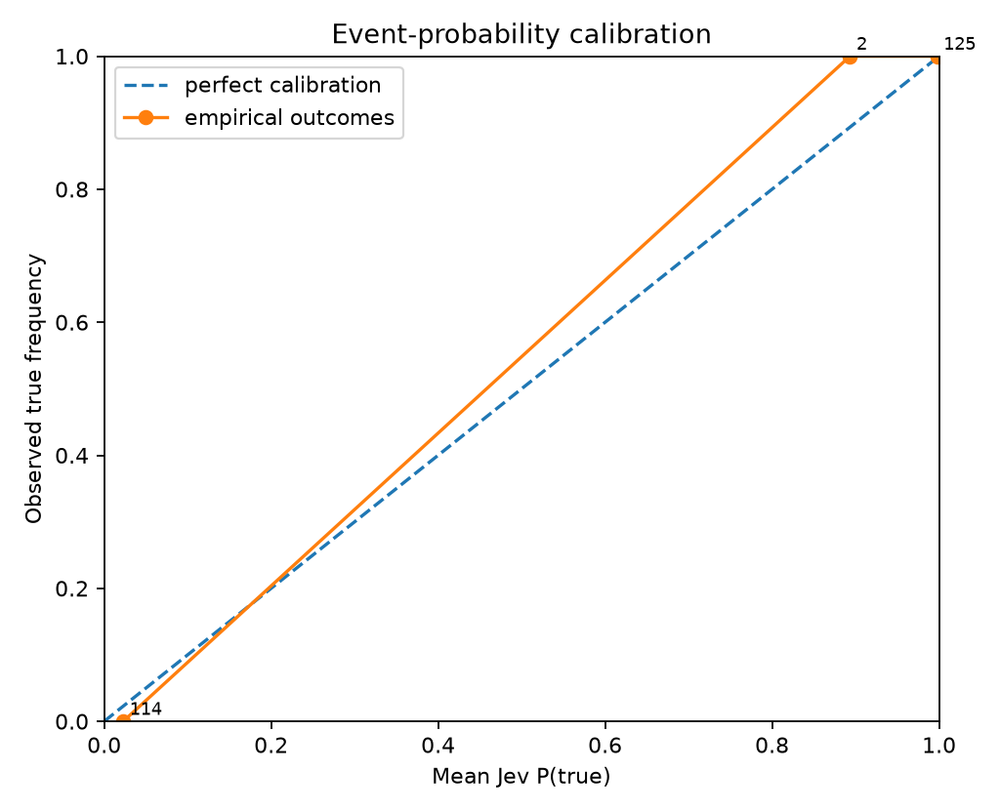
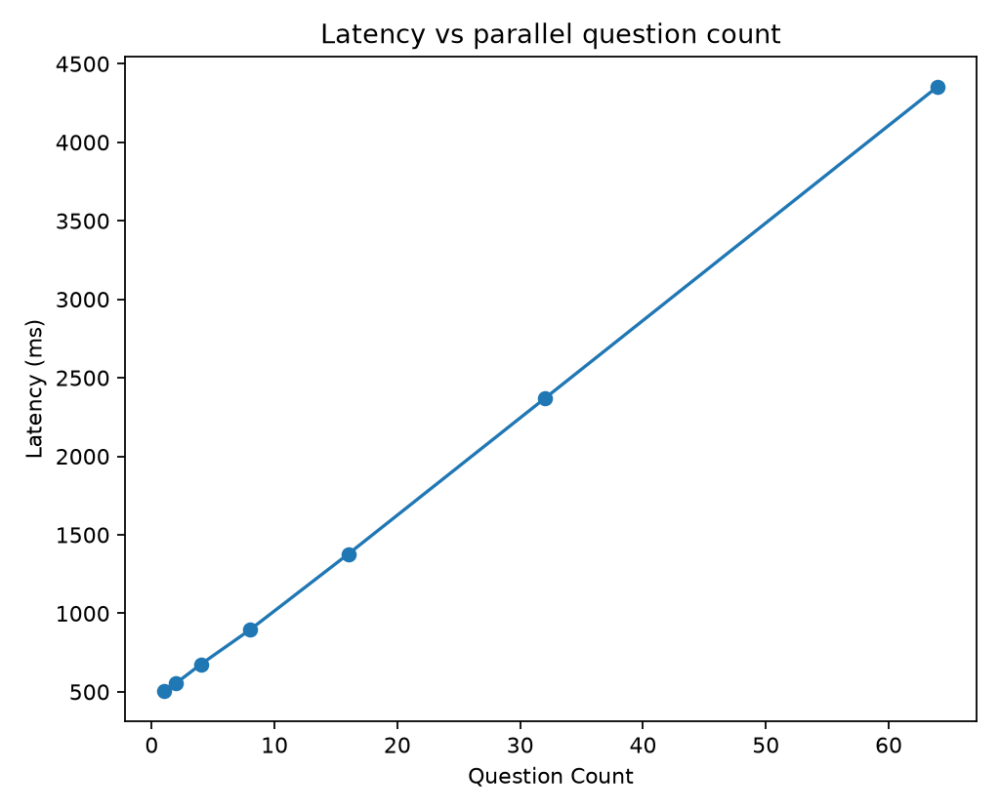
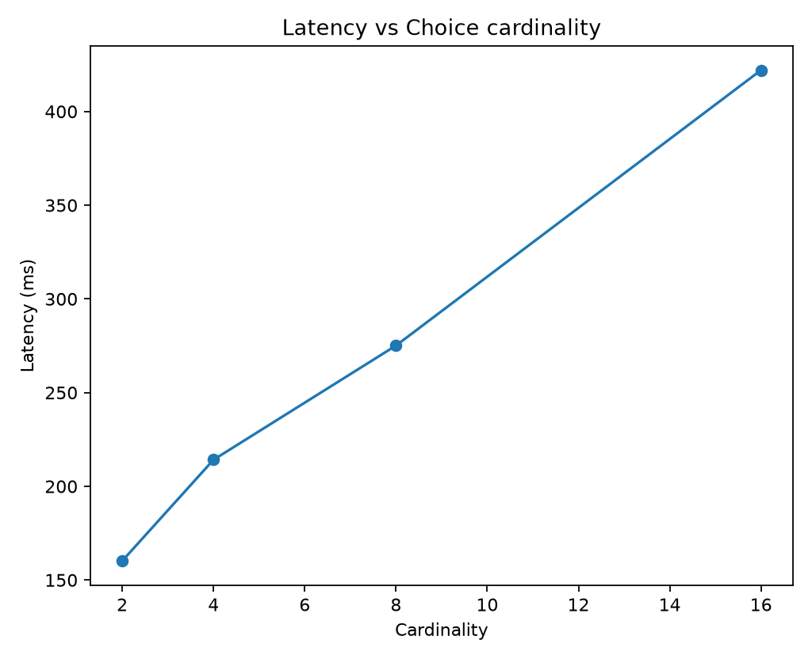
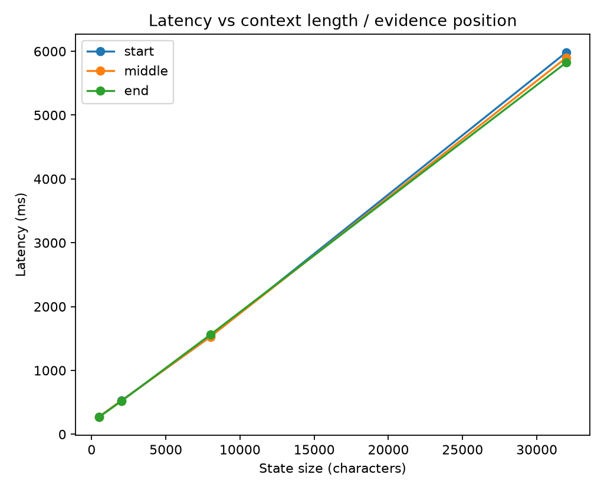

# Jev Black-Box Benchmark Report

> Private evaluation report. Verify your contractual permissions before publishing benchmark results.

## Run health

- Requests: **303** total, **300** successful, **3** failed.
- Latency: p50 **163.9 ms**, p95 **526.2 ms**, p99 **4370.3 ms**.

## Calibration and correctness

- **noul**: n=241, accuracy=1.0000, brier_mean=0.0005, nll_mean=0.0131, ece_15=0.0129
- **choice**: n=141, accuracy=1.0000, brier_mean=0.0000, nll_mean=0.0014, ece_15=0.0014
- **score**: n=62, accuracy=1.0000, brier_mean=n/a, nll_mean=0.0378, mae_mean=0.0402

### By experiment

- **calibration_choice**: n=50, accuracy=1.0000, brier_mean=0.0000, nll_mean=0.0022
- **calibration_noul_factual**: n=50, accuracy=1.0000, brier_mean=0.0002, nll_mean=0.0097
- **calibration_noul_negation**: n=50, accuracy=1.0000, brier_mean=0.0001, nll_mean=0.0081
- **calibration_score**: n=50, accuracy=1.0000, nll_mean=0.0465, mae_mean=0.0487
- **candidate_order_invariance**: n=16, accuracy=1.0000, brier_mean=0.0000, nll_mean=0.0013
- **choice_cardinality_scaling**: n=4, accuracy=1.0000, brier_mean=0.0000, nll_mean=0.0002
- **context_length_position**: n=12, accuracy=1.0000, brier_mean=0.0000, nll_mean=0.0003
- **contradiction_sensitivity**: n=2, accuracy=1.0000, brier_mean=0.0000, nll_mean=0.0013
- **domain_generalization**: n=6, accuracy=1.0000, brier_mean=0.0001, nll_mean=0.0041
- **evidence_removal**: n=4, accuracy=1.0000, brier_mean=0.0000, nll_mean=0.0015
- **irrelevant_context_robustness**: n=6, accuracy=1.0000, brier_mean=0.0000, nll_mean=0.0000
- **label_key_invariance**: n=16, accuracy=1.0000, brier_mean=0.0000, nll_mean=0.0001
- **parallel_question_scaling**: n=127, accuracy=1.0000, brier_mean=0.0009, nll_mean=0.0177
- **question_independence**: n=6, accuracy=1.0000, brier_mean=0.0000, nll_mean=0.0050
- **question_paraphrase_invariance**: n=8, accuracy=1.0000, brier_mean=0.0000, nll_mean=0.0009
- **repeatability**: n=36, accuracy=1.0000, brier_mean=0.0000, nll_mean=0.0009, mae_mean=0.0046
- **state_prompt_injection**: n=1, accuracy=1.0000, brier_mean=0.0000, nll_mean=0.0002

### Selective prediction

- At ~50% coverage: error/risk **0.00%**, threshold **0.9985**, n=191.
- At ~75% coverage: error/risk **0.00%**, threshold **0.9890**, n=287.
- At ~90% coverage: error/risk **0.00%**, threshold **0.9770**, n=344.
- At ~95% coverage: error/risk **0.00%**, threshold **0.9579**, n=363.
- At ~100% coverage: error/risk **0.00%**, threshold **0.8933**, n=382.

## Metamorphic / architectural probes

- **Candidate-order invariance:** 16 trials; mean JSD=0.000672, max JSD=0.000918, max absolute probability delta=0.001665.
- **Question paraphrase invariance:** 8 trials; mean JSD=0.000015, max JSD=0.000054.
- **Question independence:** worst max probability delta=0.000611 at bundle size 2 (JSD=0.000010).
- **Repeatability/outage:** max probability std=0.00000000, max range=0.00000000 across 12 identical calls.
- **Repeatability/severity:** max probability std=0.00000000, max range=0.00000000 across 12 identical calls.
- **Repeatability/route:** max probability std=0.00000000, max range=0.00000000 across 12 identical calls.

### Evidence removal

Expected healthy behavior: decisive-class probability/confidence should generally fall, while `insufficient` mass or entropy rises as decisive evidence is removed.

- level 0: top=[('billing', 0.9995860280581194), ('insufficient', 0.0002959221758450702)], confidence=0.9996, normalized_entropy=0.0025
- level 1: top=[('billing', 0.9999253674203272), ('insufficient', 4.006230721645128e-05)], confidence=0.9999, normalized_entropy=0.0005
- level 2: top=[('billing', 0.9974803946016297), ('insufficient', 0.0021819795037526244)], confidence=0.9975, normalized_entropy=0.0117
- level 3: top=[('insufficient', 0.9968466553593177), ('billing', 0.0027999370984054263)], confidence=0.9968, normalized_entropy=0.0142

## Figures

## Interpretation guardrails

- Good top-1 accuracy does **not** establish calibration.
- Good in-distribution calibration does **not** establish epistemic uncertainty under distribution shift.
- Near-zero drift under reordered options/questions supports invariance claims, but does not reveal the hidden architecture uniquely.
- A flat latency curve versus question count supports parallel execution; it does not by itself prove a particular neural architecture.
- Treat this report as a black-box behavioral evaluation, not reverse-engineering of weights or proprietary training data.