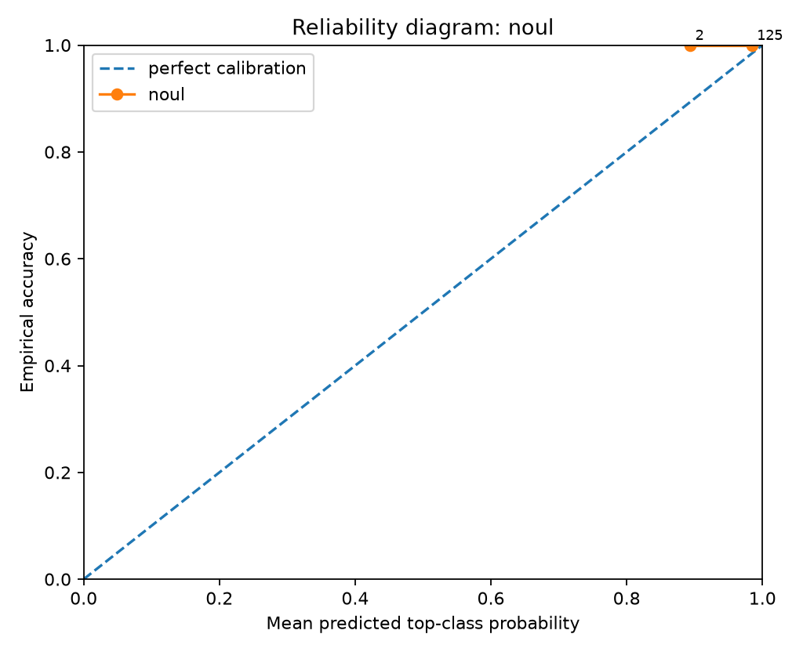
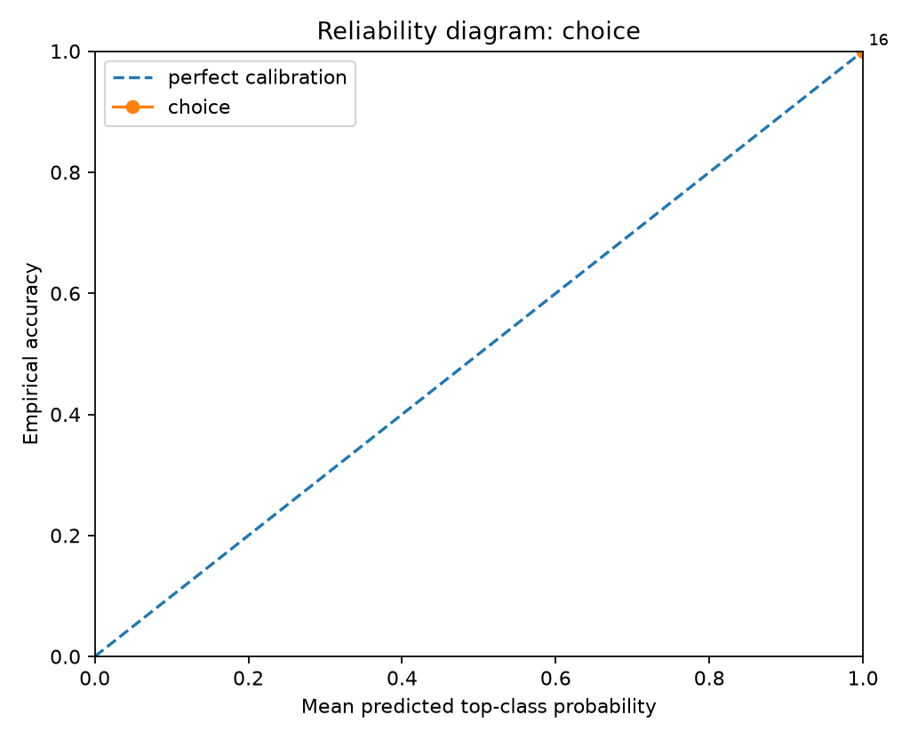
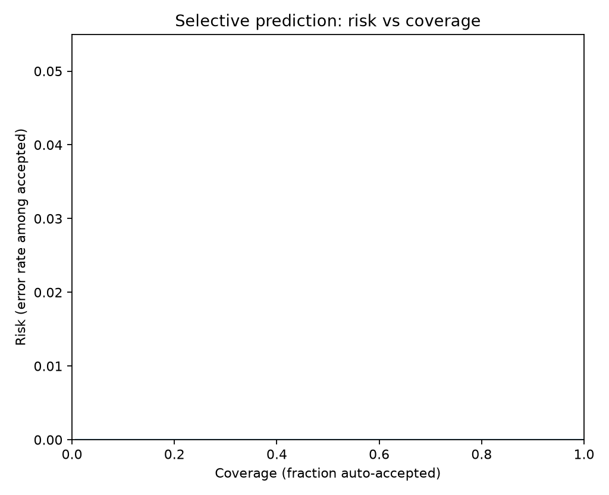
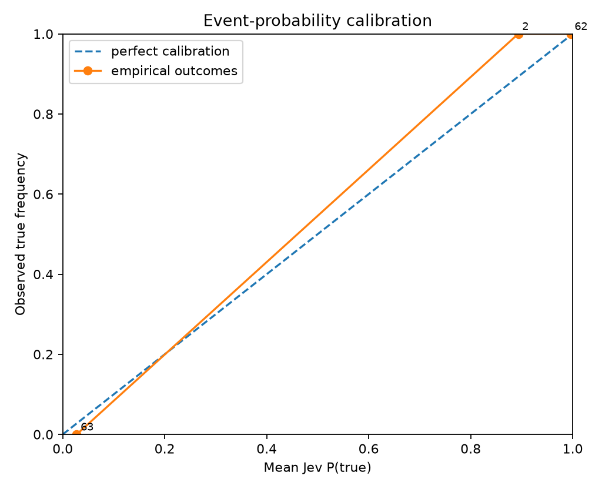
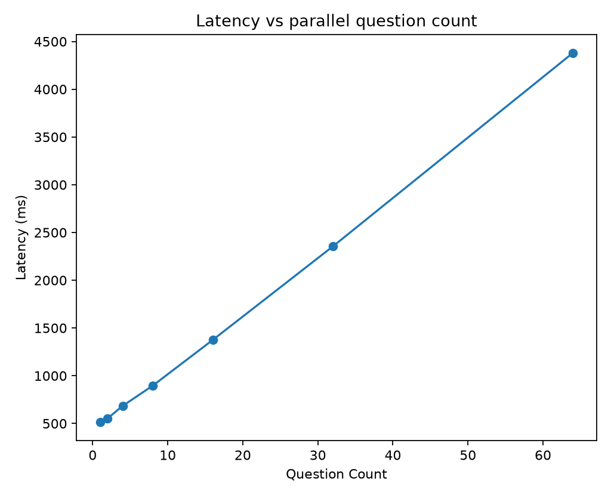
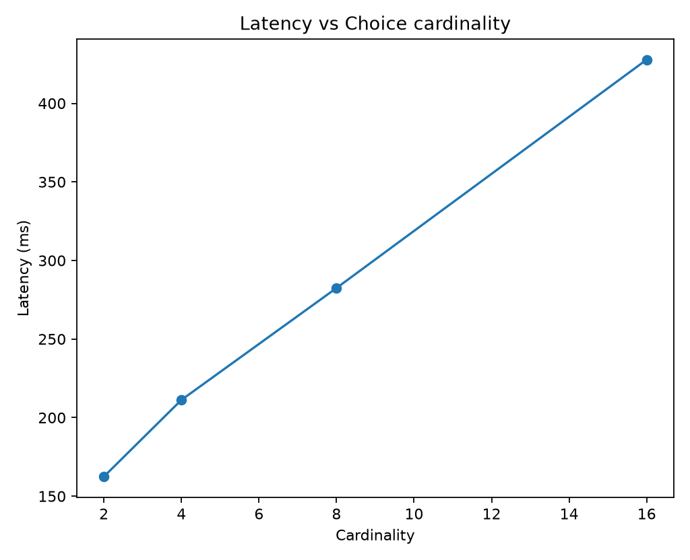
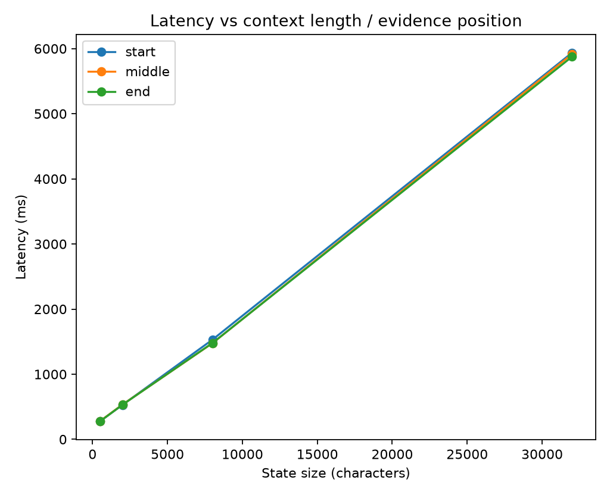

# Jev Black-Box Benchmark Report

> Private evaluation report. Verify your contractual permissions before publishing benchmark results.

## Run health

- Requests: **26** total, **23** successful, **3** failed.
- Latency: p50 **554.0 ms**, p95 **5912.9 ms**, p99 **5933.2 ms**.

## Calibration and correctness

- **noul**: n=127, accuracy=1.0000, brier_mean=0.0009, nll_mean=0.0177, ece_15=0.0173
- **choice**: n=16, accuracy=1.0000, brier_mean=0.0000, nll_mean=0.0003, ece_15=0.0003

### By experiment

- **choice_cardinality_scaling**: n=4, accuracy=1.0000, brier_mean=0.0000, nll_mean=0.0002
- **context_length_position**: n=12, accuracy=1.0000, brier_mean=0.0000, nll_mean=0.0003
- **parallel_question_scaling**: n=127, accuracy=1.0000, brier_mean=0.0009, nll_mean=0.0177

### Selective prediction

- At ~50% coverage: error/risk **0.00%**, threshold **0.9954**, n=72.
- At ~75% coverage: error/risk **0.00%**, threshold **0.9820**, n=108.
- At ~90% coverage: error/risk **0.00%**, threshold **0.9526**, n=129.
- At ~95% coverage: error/risk **0.00%**, threshold **0.9241**, n=136.
- At ~100% coverage: error/risk **0.00%**, threshold **0.8933**, n=143.

## Metamorphic / architectural probes

## Figures

## Interpretation guardrails

- Good top-1 accuracy does **not** establish calibration.
- Good in-distribution calibration does **not** establish epistemic uncertainty under distribution shift.
- Near-zero drift under reordered options/questions supports invariance claims, but does not reveal the hidden architecture uniquely.
- A flat latency curve versus question count supports parallel execution; it does not by itself prove a particular neural architecture.
- Treat this report as a black-box behavioral evaluation, not reverse-engineering of weights or proprietary training data.