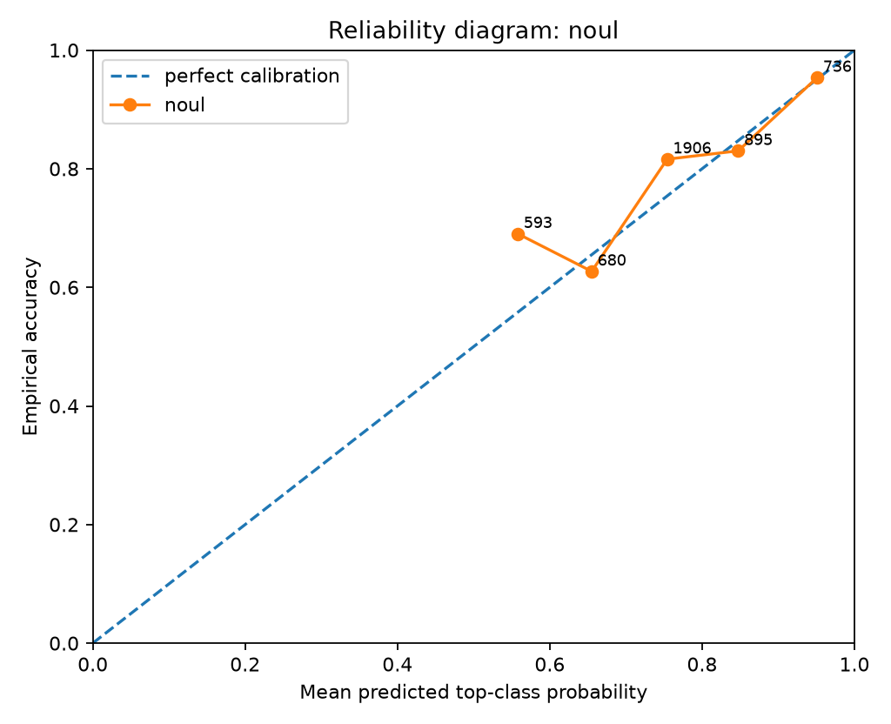
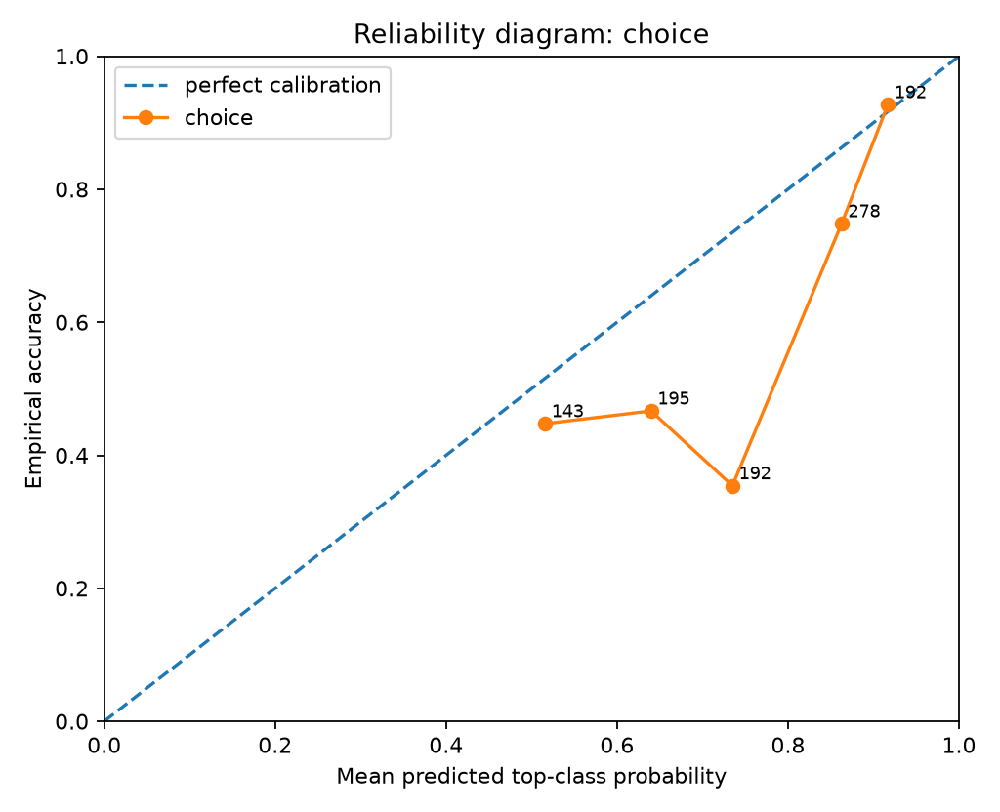
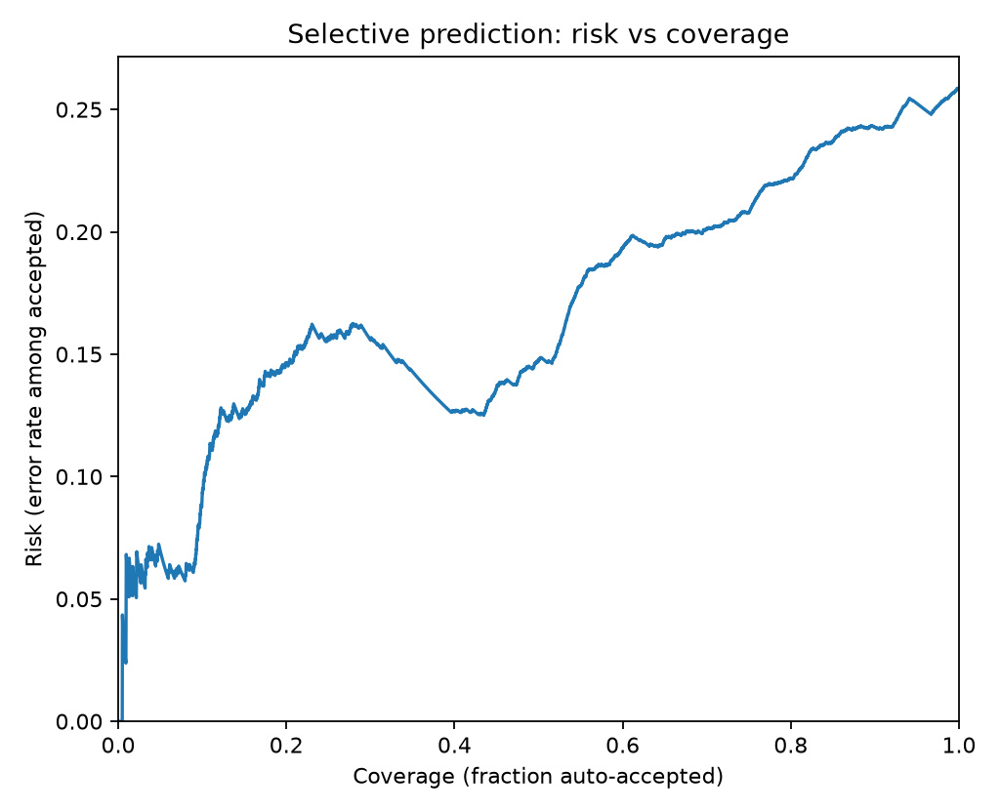
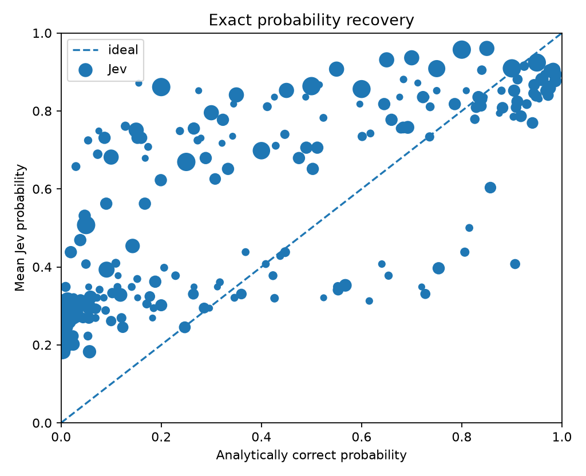
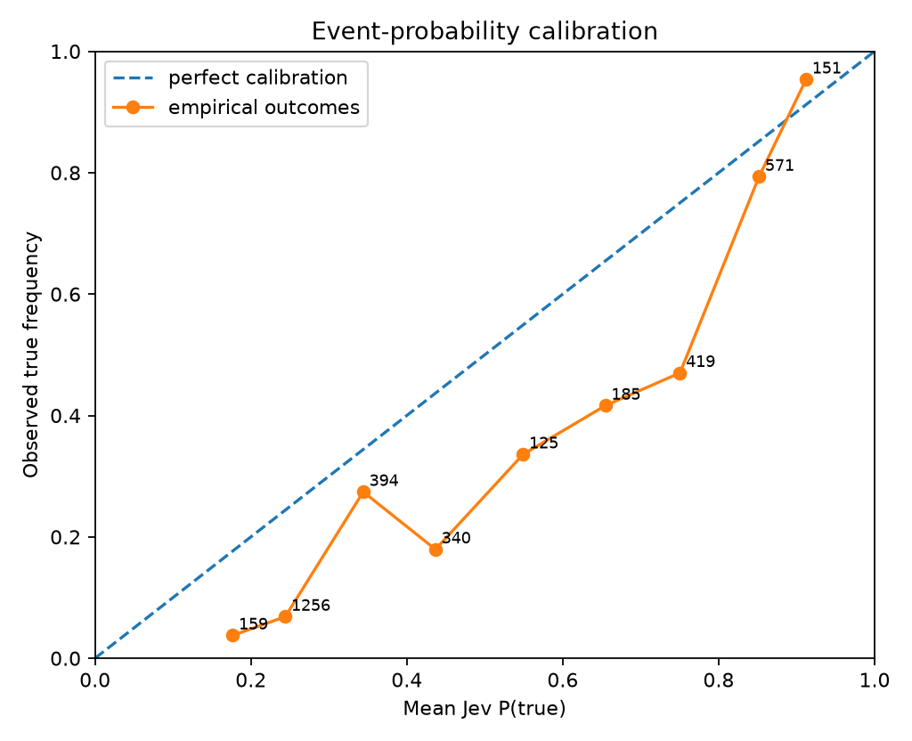
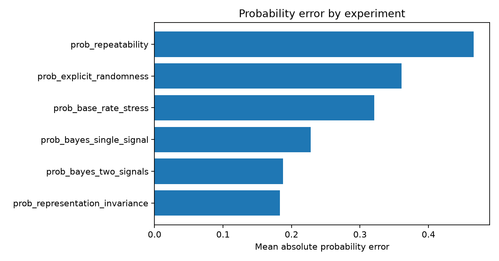

# Jev Black-Box Benchmark Report

> Private evaluation report. Verify your contractual permissions before publishing benchmark results.

## Run health

- Requests: **5810** total, **5810** successful, **0** failed.
- Latency: p50 **206.1 ms**, p95 **264.5 ms**, p99 **265.6 ms**.

## Calibration and correctness

- **noul**: n=4810, accuracy=0.7781, brier_mean=0.1676, nll_mean=0.5132, ece_15=0.0581
- **choice**: n=1000, accuracy=0.6090, brier_mean=0.5479, nll_mean=1.0141, ece_15=0.1465

### By experiment

- **prob_base_rate_stress**: n=600, accuracy=0.4550, brier_mean=0.3093, nll_mean=0.8260
- **prob_bayes_single_signal**: n=1500, accuracy=0.8187, brier_mean=0.1628, nll_mean=0.5068
- **prob_bayes_two_signals**: n=1500, accuracy=0.8667, brier_mean=0.1158, nll_mean=0.3945
- **prob_explicit_randomness**: n=760
- **prob_multiclass_bayes**: n=1000, accuracy=0.6090, brier_mean=0.5479, nll_mean=1.0141
- **prob_repeatability**: n=150
- **prob_representation_invariance**: n=300

### Selective prediction

- At ~50% coverage: error/risk **14.78%**, threshold **0.7549**, n=2300.
- At ~75% coverage: error/risk **20.78%**, threshold **0.6624**, n=3450.
- At ~90% coverage: error/risk **24.28%**, threshold **0.5622**, n=4140.
- At ~95% coverage: error/risk **25.24%**, threshold **0.5312**, n=4370.
- At ~100% coverage: error/risk **25.87%**, threshold **0.5000**, n=4600.

## Probabilistic calibration

- **Binary exact-probability recovery:** n=4810, MAE=0.2526, RMSE=0.3067, bias=0.2010, max error=0.9169, Pearson r=0.7498.
- **Sampled-world empirical calibration:** n=3600, event ECE(15)=0.1628, Brier=0.1676, NLL=0.5132.
- Returned 56 distinct binary probability values in this run.

### Probability bins

| Jev bin | n | mean Jev p | mean exact p | empirical true rate |
|---|---:|---:|---:|---:|
| 0.1-0.2 | 163 | 0.1768 | 0.0173 | 0.0377 |
| 0.2-0.3 | 1298 | 0.2449 | 0.0586 | 0.0685 |
| 0.3-0.4 | 438 | 0.3447 | 0.2452 | 0.2741 |
| 0.4-0.5 | 412 | 0.4366 | 0.1965 | 0.1794 |
| 0.5-0.6 | 181 | 0.5456 | 0.2381 | 0.3360 |
| 0.6-0.7 | 242 | 0.6544 | 0.4264 | 0.4162 |
| 0.7-0.8 | 608 | 0.7521 | 0.4817 | 0.4702 |
| 0.8-0.9 | 732 | 0.8527 | 0.7532 | 0.7933 |
| 0.9-1.0 | 736 | 0.9510 | 0.6676 | 0.9536 |

- **Multiclass posterior recovery:** n=1000, mean TV=0.1831, p95 TV=0.4012, mean JSD=0.0454, mean KL(target||Jev)=0.2305, soft Brier=0.0883, sampled-label accuracy=0.6090.

## Metamorphic / architectural probes

- **Probabilistic repeatability/p20:** target=0.2000, mean=0.9399, std=0.000000, range=0.000000 across 50 identical calls.
- **Probabilistic repeatability/p50:** target=0.5000, mean=0.9740, std=0.000000, range=0.000000 across 50 identical calls.
- **Probabilistic repeatability/p80:** target=0.8000, mean=0.9841, std=0.000000, range=0.000000 across 50 identical calls.
- **Probability representation invariance:** mean within-group range=0.134869, max range=0.277300 across percent/decimal/frequency renderings.

## Figures

## Interpretation guardrails

- Good top-1 accuracy does **not** establish calibration.
- Good in-distribution calibration does **not** establish epistemic uncertainty under distribution shift.
- Near-zero drift under reordered options/questions supports invariance claims, but does not reveal the hidden architecture uniquely.
- A flat latency curve versus question count supports parallel execution; it does not by itself prove a particular neural architecture.
- Treat this report as a black-box behavioral evaluation, not reverse-engineering of weights or proprietary training data.