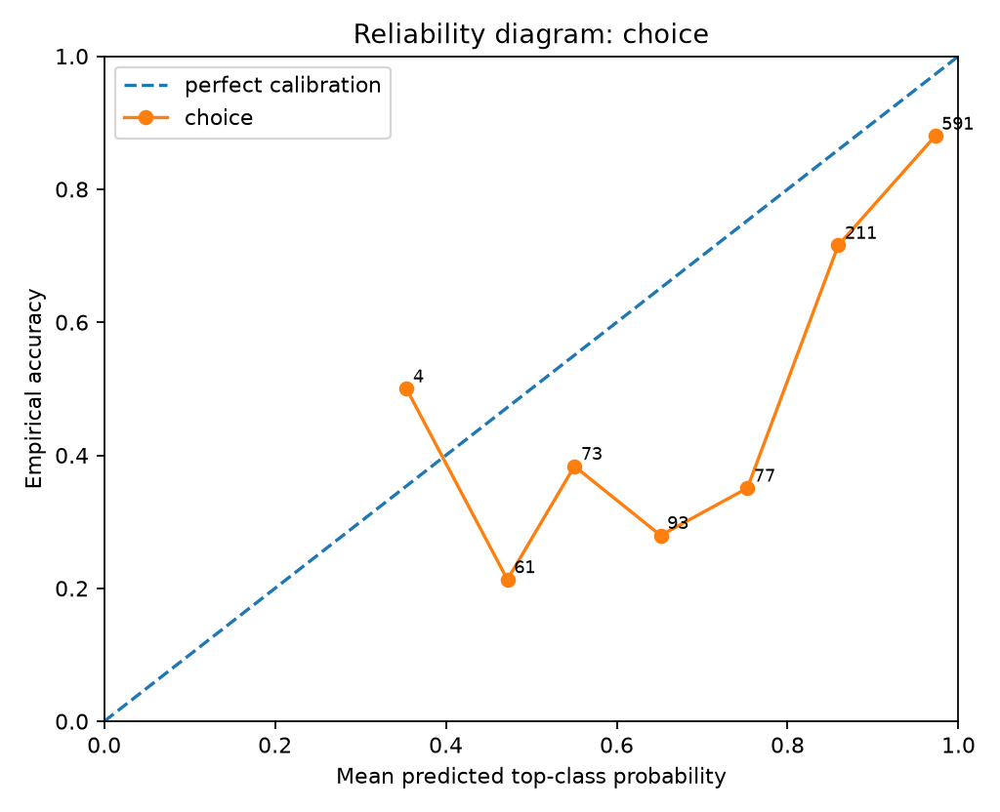
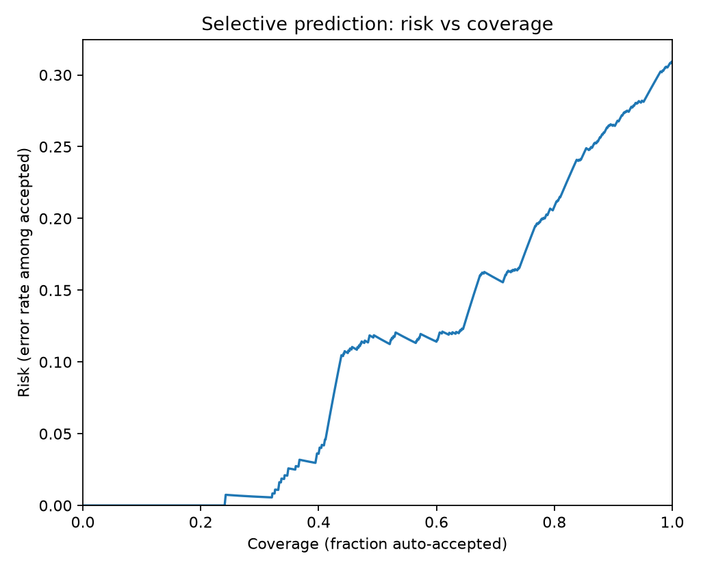
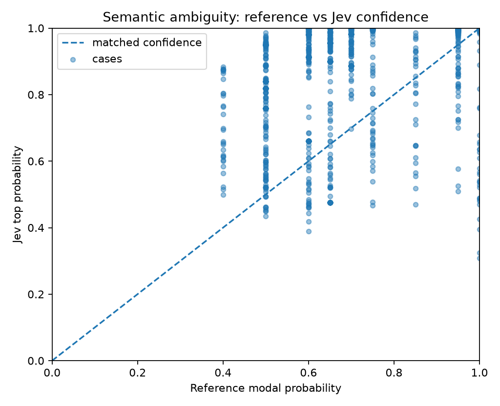
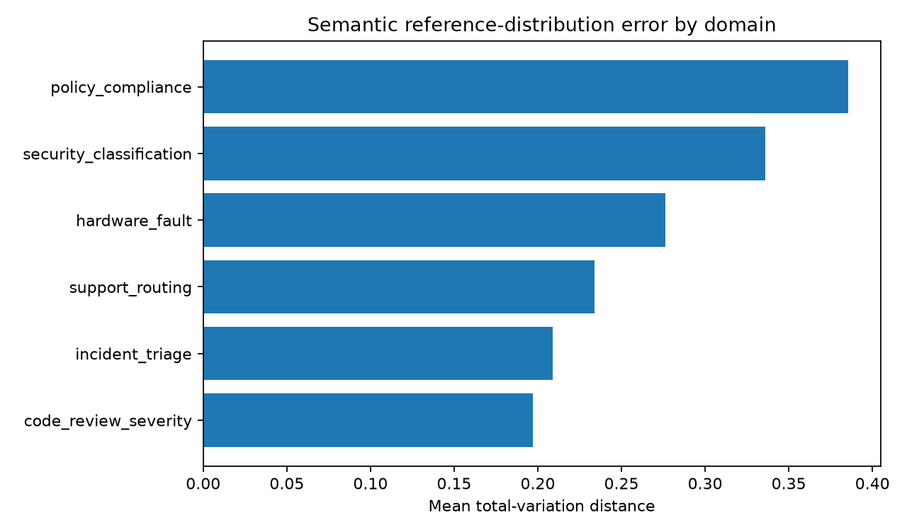

# Jev Black-Box Benchmark Report

> Private evaluation report. Verify your contractual permissions before publishing benchmark results.

## Run health

- Requests: **1110** total, **1110** successful, **0** failed.
- Latency: p50 **208.5 ms**, p95 **362.2 ms**, p99 **397.7 ms**.

## Calibration and correctness

- **choice**: n=1110, accuracy=0.6910, brier_mean=0.3949, nll_mean=0.6828, ece_15=0.1615

### By experiment

- **semantic_adjudication**: n=720, accuracy=0.7319, brier_mean=0.3460, nll_mean=0.5783
- **semantic_repeatability**: n=390, accuracy=0.6154, brier_mean=0.4853, nll_mean=0.8758

### Selective prediction

- At ~50% coverage: error/risk **11.71%**, threshold **0.9132**, n=555.
- At ~75% coverage: error/risk **17.65%**, threshold **0.7592**, n=833.
- At ~90% coverage: error/risk **26.53%**, threshold **0.5628**, n=999.
- At ~95% coverage: error/risk **28.15%**, threshold **0.4795**, n=1055.
- At ~100% coverage: error/risk **30.90%**, threshold **0.3077**, n=1110.

## Probabilistic calibration

- **Multiclass posterior recovery:** n=1110, mean TV=0.3012, p95 TV=0.5896, mean JSD=0.0966, mean KL(target||Jev)=0.6674, soft Brier=0.1989, sampled-label accuracy=0.6910.

## Semantic adjudication calibration

- Cases: **1110**; modal accuracy=0.6910; mean TV=0.3012; mean JSD=0.0966; soft Brier=0.1989.
- Mean reference top probability=0.6770; mean Jev top probability=0.8514; mean overconfidence gap=0.1744.
- Mean normalized reference entropy=0.5408; Jev entropy=0.2941; entropy gap=-0.2467.

### By semantic domain

| Domain | n | modal accuracy | mean TV | mean overconfidence gap | ref entropy | Jev entropy |
|---|---:|---:|---:|---:|---:|---:|
| code_review_severity | 210 | 0.7667 | 0.2417 | 0.1516 | 0.5845 | 0.3328 |
| hardware_fault | 150 | 0.9267 | 0.2971 | 0.2308 | 0.6142 | 0.2333 |
| incident_triage | 210 | 0.8143 | 0.2291 | 0.1460 | 0.5260 | 0.3166 |
| policy_compliance | 150 | 0.7467 | 0.3883 | 0.0657 | 0.3591 | 0.2237 |
| security_classification | 180 | 0.5222 | 0.3629 | 0.2342 | 0.5261 | 0.1843 |
| support_routing | 210 | 0.4286 | 0.3204 | 0.2116 | 0.6017 | 0.4205 |

## Metamorphic / architectural probes

## Figures

## Interpretation guardrails

- Good top-1 accuracy does **not** establish calibration.
- Good in-distribution calibration does **not** establish epistemic uncertainty under distribution shift.
- Near-zero drift under reordered options/questions supports invariance claims, but does not reveal the hidden architecture uniquely.
- A flat latency curve versus question count supports parallel execution; it does not by itself prove a particular neural architecture.
- Treat this report as a black-box behavioral evaluation, not reverse-engineering of weights or proprietary training data.